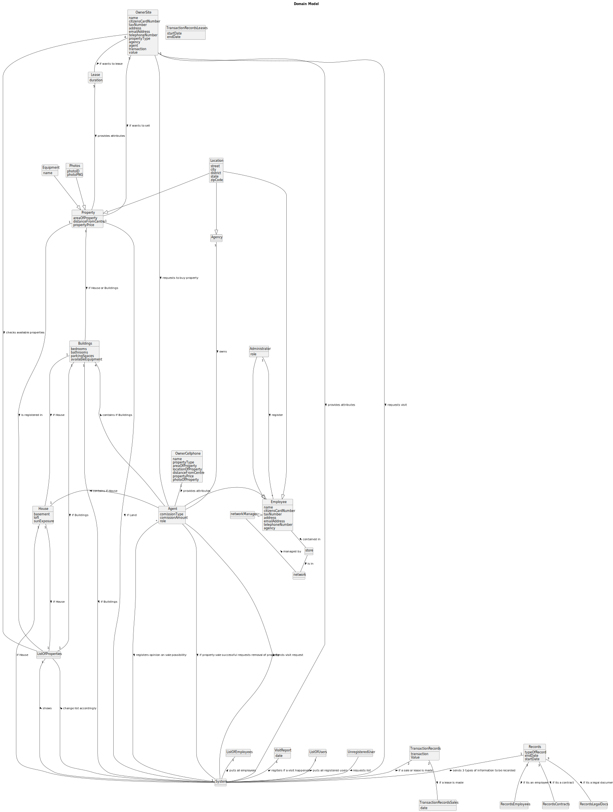

# Analysis

The construction process of the domain model is based on the client specifications, especially the nouns (for _concepts_) and verbs (for _relations_) used. 

## Rationale to identify domain conceptual classes ##
To identify domain conceptual classes, start by making a list of candidate conceptual classes inspired by the list of categories suggested in the book "Applying UML and Patterns: An Introduction to Object-Oriented Analysis and Design and Iterative Development". 

### _Conceptual Class Category List_ ###

**Business Transactions**

* lease

---

**Transaction Line Items**

* house
* buildings ( apartment )
* properties ( land )

---

**Product/Service related to a Transaction or Transaction Line Item**

*  listOfProperties

---

**Transaction Records**

* transactionsRecords
* transactionsRecordsLeases
* transactionsRecordsSales

---  

**Roles of People or Organizations**

* actor
* unregisteredUser
* administrator
* employee
* agent
* agency
* networkManager
* 

---

**Places**

*  locationProperty

---

**Noteworthy Events**

* visitReport
---

**Physical Objects**

* house
* apartment
* land

---

**Descriptions of Things**

* photos
* equipment

---

**Catalogs**

*  property
*  buildings
*  house
*  actor
*  agent

---

**Containers**

*  listOfProperties
*  listOfEmployees
*  listOfUsers

---

**Elements of Containers**

* property  
* buildings
* house
* actor
* unregisteredUser
* administrator
* employee
* agent
* networkManager

---

**Organizations**

*  agency

---

**Other External/Collaborating Systems**

*  network

---

**Records of finance, work, contracts, legal matters**

* records
* recordsEmployees
* recordsContracts
* recordsLegalDocs

---

**Financial Instruments**

*  sale
*  lease

---

**Documents mentioned/used to perform some work/**

*  [NOT MENTIONED]

---

###**Rationale to identify associations between conceptual classes**###

An association is a relationship between instances of objects that indicates a relevant connection and that is worth of remembering, or it is derivable from the List of Common Associations:

| Concept (A) 		        |                         Association   	                         |              Concept (B) |
|-----------------------|:---------------------------------------------------------------:|-------------------------:|
| OwnerSite  	          |                   provides attributes    		 	                   |                   System |
| OwnerSite	            |                    requests visit       		 	                    |                   System |
| OwnerSite	            |               checks available properties   		 	                |         ListOfProperties |
| OwnerSite	            |                requests to buy property    		 	                 |                    Agent |
| OwnerSite 	           |                     wants to lease    		 	                      |                    Lease |
| OwnerSite	            |                     if wants to sell   		 	                     |                 Property |
| Administrator  	      |                        register    		 	                         |                 Employee |
| Administrator  	      |                         extends   		 	                          |                 Employee |
| NetworkManager  	     |                         extends   		 	                          |                 Employee |
| Agent  	              |         registers opinion on sale possibility     		 	          |                   System |
| Agent  	              | if property sale successful requests removal of property   		 	 |                   System |
| Agent 	               |                         extends   		 	                          |                 Employee |
| System  	             |                    puts all employees  		 	                     |          ListOfEmployees |
| System  	             |               registers if a visit happened  		 	               |             VisitReports |
| System  	             |                if a sale or lease is made  		 	                 |       TransactionRecords |
| System 	              |                   puts all of its users  		 	                   |              ListOfUsers |
| System 	              |                 sends visit request        		 	                 |                    Agent |
| System  	             |        sends 3 types of information to be recorded 		 	         |                  Records |
| TransactionRecords 	  |                     if a sale is made  		 	                     |  TransactionRecordsSales |
| TransactionRecords  	 |                    if a lease is made   		 	                    | TransactionRecordsLeases |
| Records  	            |                   if its an employee     		 	                   |         RecordsEmployees |
| Records  	            |                if its a legal document     		 	                 |         RecordsLegalDocs |
| Records  	            |                   if its a contract     		 	                    |         RecordsContracts |
| Employee  	           |                     is contained in   		 	                      |                    Store |
| Location	             |                         extends   		 	                          |                 Property |
| Location	             |                         extends   		 	                          |                   Agency |
| Location	             |                         extends   		 	                          |                 Employee |
| UnregisteredUser	     |                      requests list   		 	                       |                   System |
| ListOfProperties  	   |                          shows    		 	                          |                   System |
| ListOfProperties 	    |                changes list accordingly    		 	                 |                   System |
| House  	              |                    is registered in    		 	                     |         ListOfProperties |
| House  	              |                    contains if house    		 	                    |                    Agent |
| House  	              |                        if house    		 	                         |                   System |
| Buildings 	           |             is registered if its an apartment  		 	             |         ListOfProperties |
| Buildings  	          |                  contains if buildings    		 	                  |                    Agent |
| Buildings  	          |                      if buildings    		 	                       |                   System |
| Buildings  	          |                        if house    		 	                         |                    House |
| OwnerCellphone  	     |                   provides attributes    		 	                   |                    Agent |
| Property  	           |                         if land    		 	                         |                   System |
| Property 	            |                 is registered if its land 		 	                  |         ListOfProperties |
| Property  	           |                  if house or buildings   		 	                   |                Buildings |
| Store  	              |                          is in    		 	                          |                  Network |
| Lease  	              |               requests to lease property    		 	                |                    Agent |
| Network  	            |                       managed by    		 	                        |           NetworkManager |
| Equipment  	          |                         extends    		 	                         |                 Property |
| Photos 	              |                          extends  		 	                          |                 Property |

## Domain Model

**Do NOT forget to identify concepts atributes too.**

**Insert below the Domain Model Diagram in a SVG format**

