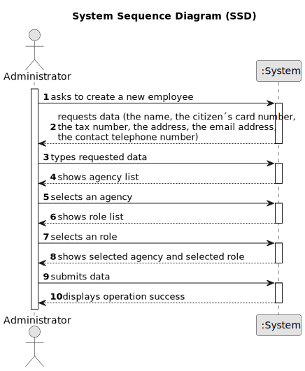

# US 003 - To register a new employee

## 1. Requirements Engineering

### 1.1. User Story Description

As a system administrator, I want to register a new employee.

### 1.2. Customer Specifications and Clarifications 

**From the specifications document:**

>	"The company´s systems administrator will be responsible for registering all employees (specifying the name, the citizen´s card number, the tax number, the address, the email address, the contact telephone number and the agency to which it is assigned)..."

**From the client clarifications:**

> **Question:** What would be the attributes of the System Administrator, Agency and the Roles?
>  
> **Answer:** The System Administrator is an employee. You can get the roles from the project description. Please check the project description.
Moreover, I just answered a question to clarify what are the attributes of an agency/store.

> **Question:** The administrator when registering a new employee will also have to specify the category/office that he will perfom (for example agent, store manager, store network manager)?
>  
> **Answer:** The administrator has to specify the role of the employee.

> **Question:** Can an employee be registered to more than one agency?
>
> **Answer:** No.

> **Question:** Does the System Administrator have permission to create, edit, delete, or just create new employee registrations?
>
> **Answer:** For now, the System Administrator can only do what is specified in the Project Requirements.

> **Question:** When registering a new employee, all the required data (name, citizen's card number, etc...) have to be filled or exists not mandatory data?
>
> **Answer:** Required/Mandatory data that should be filled when registering an employee: name, the citizen's card number, the tax number, the email address, the contact telephone number and the agency to which it is assigned.

> **Question:** However, it was replied to a question when a new Employee is created in the system, that 8 digit Password should be automatically generated. How many digits should we go forward for password length validation in your software? And please confirm required special characters, etc.
>
> **Answer:** Sorry, I completely forgot that all our authentication systems require passwords with seven alphanumeric characters in length , including three capital letters and two digits. The password should be generated automatically. The password is sent to the employee by e-mail.

> **Question:** Does the system administrator select the agency to which the employee is assigned and his role from a list? Or does he just type that data?
>
> **Answer:** The System Administrator should select.

> **Question:** The system administrator cannot add an agent that already exists, the agent has two unique numbers that identify him (Tax number and Citizen's card number) which one should be used to identify the agent?
>
> **Answer:** The tax number.

> **Question:** Must the Tax number and Citizen's card number follow any convention? If so, which?
>
> **Answer:** You should use the tax identification number used for tax purposes in the US.

> **Question:** To register an employee I need to allocate him with a branch. To register a branch I need an employee (to be local manger) but I can't create the employee because I have no branch and I can’t create the branch because I have no employee.
>
> **Answer:** Thank you for identifying this issue. We already updated the project description. When a store is created in the system, the System Administrator should not set the Store Manager.
When registering a store, the System Administrator should introduce the following information: an ID, a designation/name, a location, a phone number and an e-mail address.

> **Question:** You've stated previously that an employee can only be registered to one agency so what happens if an employee wants/has to change agencies and needs to be registered to a new one? Should the system reject such operation or should the employee's previous registration be deleted?
>
> **Answer:** For now I do not want such features to be included in the system. I will discuss your suggestion with the company shareholders and I will come back here if we decide to include such features in the system.

> **Question:** Do employees use a company issued e-mail or do they have to use their personal e-mail to log-in? Can an employee use his work account to sell and/or buy property? And in case he has a company e-mail can he use it for those purposes or does it have to be his personal e-mail?
>
> **Answer:** A e-mail account is required to register an employee. This e-mail account will be used as login and will also be used as the employee business e-mail account.

> **Question:** You have stated before that name, cc number, tax number, email address, phone number and the assigned agency of the employee are the mandatory requirements to register a new one, leaving out the employee's adress and role. This confused me, because it wasn't clear whether leaving out those two characteristics from the answer was intentional or not. Futhermore, the role of the employee seems like too much of an important piece of information to be left out. My request is, then, for you to state whether or not that was a conscious decision in your answer.
>
> **Answer:** The role is required.

> **Question:**  I have a question related to the output data: when the system administrator is registering a new employee are we free to display what we feel is important or should a specific message be shown? I was thinking of displaying whether the operation was successful or not, is that fine or should something else be displayed as well?
>
> **Answer:** A good practice is to show the information and ask for confirmation.

> **Question:**  When registering employees does the administrator selects a role for them?
>
> **Answer:** Yes.

### 1.3. Acceptance Criteria

* **AC1:** Mandatory data that should be filled: name, the citizen's card number, the tax number, the email address, the contact telephone number and the agency to which it is assigned. 
* **AC2:** Address is optional.
* **AC3:** The password should have seven alphanumeric characters, including three capital letters and two digits. and should be generated automatically.
* **AC4:** The password is sent to the employee by e-mail.

### 1.4. Found out Dependencies

* There is no dependencies.

### 1.5 Input and Output Data

**Input Data:**

* Typed data:
	* name, 
	* citizen´s card number, 
	* tax number,
	* address,
	* email address,
	* contact telephone number,
	
* Selected data:
	* agency to sign,
    * role.

**Output Data:**

* successful operation.
* unsuccessful operation.

### 1.6. System Sequence Diagram (SSD)

### 1.7 Other Relevant Remarks

* There is no other relevant remarks.