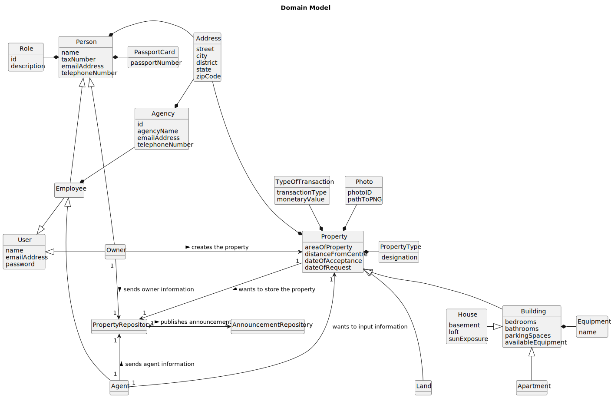

# Analysis

The construction process of the domain model is based on the client specifications, especially the nouns (for _concepts_) and verbs (for _relations_) used. 

## Rationale to identify domain conceptual classes ##
To identify domain conceptual classes, start by making a list of candidate conceptual classes inspired by the list of categories suggested in the book "Applying UML and Patterns: An Introduction to Object-Oriented Analysis and Design and Iterative Development". 

### _Conceptual Class Category List_ ###

**Business Transactions**

* TypeOfTransaction

---

**Transaction Line Items**

* House
* Building
* Property
* Land
* Apartment

---

**Product/Service related to a Transaction or Transaction Line Item**

* PropertyRepository
* AnnouncementRepository

---

**Roles of People or Organizations**

* Owner
* Agent
* Employee

---

**Places**

*  Address

---

**Physical Objects**

* Property
* Building
* House
* Apartment
* Land

---

**Descriptions of Things**

* Photo
* Equipment
* Address
* PassportCard
* Role
* PropertyType
* TypeOfTransaction

---

**Catalogs**

*  Property
*  Buildings
*  House
*  Agent

---

**Containers**

*  PropertyRepository
*  AnnouncementRepository

---

**Elements of Containers**

* House
* Land
* Apartment
* Agent
* Owner

---

**Organizations**

*  Agency

---

**Financial Instruments**

*  TypeOfTransaction

---

**Documents mentioned/used to perform some work/**

*  [NOT MENTIONED]

---

###**Rationale to identify associations between conceptual classes**###

An association is a relationship between instances of objects that indicates a relevant connection and that is worth of remembering, or it is derivable from the List of Common Associations:

| Concept (A) 		     |       Association   	       |            Concept (B) |
|--------------------|:---------------------------:|-----------------------:|
| Address            |          composes           |                 Person |
| Address            |          composes           |               Property |
| Address            |          composes           |                 Agency |
| Apartment          |            is an            |               Building |
| Agency             |          composes           |               Employee |
| Agent              |            is an            |               Employee |
| Agent              |   sends agent information   |     PropertyRepository |
| Agent              | wants to input information  |               Property |
| Building           |            is an            |               Property |
| Employee           |            is an            |                 Person |
| Employee           |            is an            |                   User |
| Equipment          |          composes           |               Building |
| House              |            is an            |               Building |
| Land               |            is an            |               Property |
| Owner              |            is an            |                   User |
| Owner              |            is an            |                 Person |
| Owner              |    creates the property     |               Property |
| Owner              |   sends owner information   |     PropertyRepository |
| PassportCard       |          composes           |                 Person |
| Photo              |          composes           |               Property |
| Property           | wants to store the property |     PropertyRepository |
| PropertyRepository |   publishes announcement    | AnnouncementRepository |
| PropertyType       |          composes           |               Property |
| Role               |          composes           |                 Person |
| TypeOfTransaction  |          composes           |               Property |

## Domain Model

**Do NOT forget to identify concepts atributes too.**

**Insert below the Domain Model Diagram in a SVG format**

