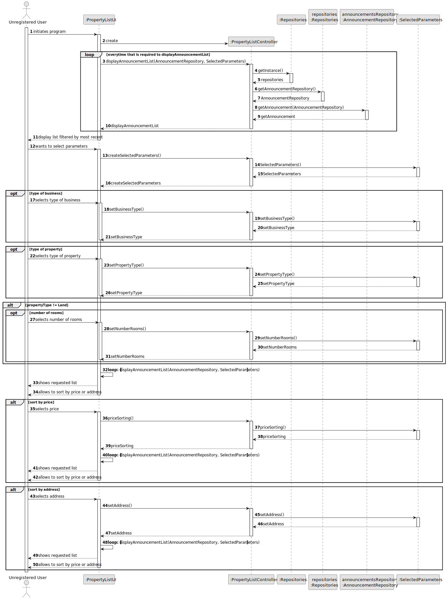
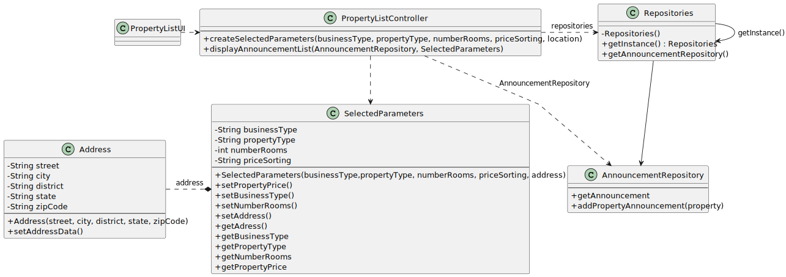

# US 001 - To Display Listed Properties 

## 3. Design - User Story Realization 

### 3.1. Rationale

| Interaction ID | Question: Which class is responsible for...                            | Answer                   | Justification (with patterns)   |
|:---------------|:-----------------------------------------------------------------------|:-------------------------|:--------------------------------|
| Step 1  		     | 	... initiating the system?                                            | *PropertyListUI*         | Pure Fabrication                |
| Step 2  		     | 	... storing the approved properties list?                             | AnnouncementRepository   | IE: all the properties on sale  |
|                | ... getting the approved properties list?                              | *PropertyListController* | Pure Fabrication                |
|                | ... displaying the approved properties list?                           | *PropertyListUI*         | Pure Fabrication                |
| Step 3         | ... creating the selected parameters?                                  | *PropertyListController* | Pure Fabrication                |
| 		             | 	... saving the selected parameters?                                   | *SelectedParameters*     | Creator                         |
| Step 4  		     | 	... displaying the properties list with the parameters?               | *PropertyListUI*         | Pure Fabrication                |
|                | ... getting the approved properties list with the selected parameters? | *PropertyListController* | Pure Fabrication                |
|                | ... providing the selected parameters?                                 | *SelectedParameters*     | Pure Fabrication                |
|                | ... providing the approved properties?                                 | AnnouncementRepository   | IE: all the properties on sale  |
| Step 5  		     | 	... allowing to sort by price or location?                            | *PropertyListController* | Pure Fabrication                |
| Step 6  		     | 	... saving the selected parameters?                                   | *SelectedParameters*     | Pure Fabrication                |
| Step 7  		     | 	... showing the selected list?                                        | *PropertyListUI*         | Pure Fabrication                | 
|                | ... getting the approved properties list with the selected parameters? | *PropertyListController* | Pure Fabrication                |
|                | ... providing the selected parameters?                                 | *SelectedParameters*     | Creator                         |
|                | ... providing the approved properties?                                 | AnnouncementRepository   | IE: all the properties on sale  |
| Step 8   		    | ... saving the selected parameters?                                    | *SelectedParameters*     | Creator                         |
| Step 9	  		    | ... allowing to sort by type of bussiness?                             | *PropertyListController* | Pure Fabrication                | 
| Step 10  		    | ... saving the selected parameters?                                    | *SelectedParameters*     | Pure Fabrication                | 
| Step 11        | ... displaying the properties list with the parameters?                | *PropertyListController* | Pure Fabrication                |
|                | ... provide the parameters?                                            | *SelectedParameters*     | Creator                         |
|                | ... provide the approved properties?                                   | AnnouncementRepository   | IE: all the properties on sale  |

### Systematization ##

According to the taken rationale, the conceptual classes promoted to software classes are: 

 * AnnouncementRepository
 * SelectedParameters
 

Other software classes (i.e. Pure Fabrication) identified: 

 * PropertyListUI
 * PropertyListController
 

## 3.2. Sequence Diagram (SD)

### Alternative 1 - Full Diagram

This diagram shows the full sequence of interactions between the classes involved in the realization of this user story.

## 3.3. Class Diagram (CD)

