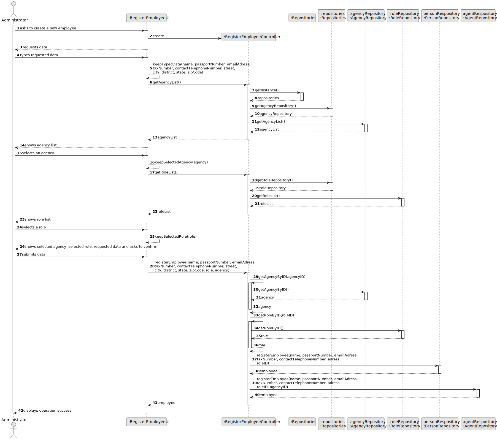
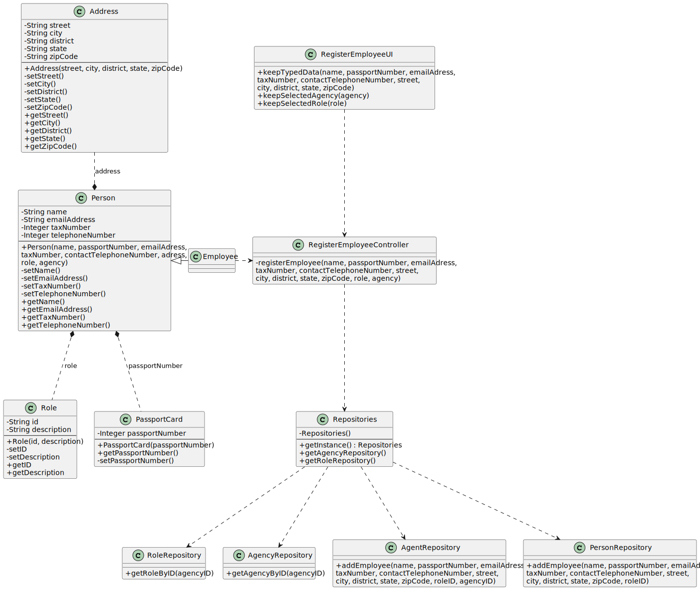

# US 003 - To register a new employee

## 3. Design - User Story Realization

### 3.1. Rationale

**SSD - Alternative 1 is adopted.**

| Interaction ID                                                  | Question: Which class is responsible for...                            | Answer                               | Justification (with patterns)                                                                                 |
|:----------------------------------------------------------------|:-----------------------------------------------------------------------|:-------------------------------------|:--------------------------------------------------------------------------------------------------------------|
| Step 1: asks to create a new employee 		                        | 	...instantiating the class that handles the UI?                       | RegisterEmployeeUI                   | Pure Fabrication: there is no reason to assign this responsibility to any existing class in the Domain Model. |
| 			  		                                                         | 	... coordinating the US?                                              | RegisterEmployeeController           | Controller                                                                                                    |
| 		                                                              | 	...knowing which user is using the system?                            | Person                               | Pure Fabrication                                                                                              |
| Step 2: requests data 		                                        | ...displaying the UI for the actor to input data?						                | RegisterEmployeeUI                   | Pure Fabrication                                                                                              |
| Step 3: types requested data                                    | ...temporarily keeping input data?                                     | RegisterEmployeeUI                   | Pure Fabrication                                                                                              |
| Step 4: shows agency list 		                                    | 	...storing the agency list?                                           | RegisterEmployeeController           | Controller                                                                                                    |
| 		                                                              | 	...obtaining the agency list?                                         | AgencyRepository                     | Pure Fabrication                                                                                              |
| 		                                                              | 	...displaying the agency list?                                        | RegisterEmployeeUI                   | Pure Fabrication                                                                                              |
| Step 5: selects an agency 		                                    | 	...validating selected agency?                                        | RegisterEmployeeController           | Controller                                                                                                    |
| 		                                                              | 	...temporarily keeping the selected agency?                           | RegisterEmployeeUI                   | Pure Fabrication                                                                                              |
| Step 6: shows role list 		                                      | 	...storing the role list?						                                       | RegisterEmployeeController           | Controller                                                                                                    |              
| 		                                                              | 	...obtaining the role list?                                           | RoleRepository                       | Pure Fabrication                                                                                              |
| 		                                                              | 	...displaying the role list?						                                    | RegisterEmployeeUI                   | Pure Fabrication                                                                                              |
| Step 7: selects an role 		                                      | 	...validating selected role?                                          | RegisterEmployeeController           | Controller                                                                                                    | 
|                                                                 | ...temporarily keeping the selected role?                              | RegisterEmployeeUI                   | Pure Fabrication                                                                                              |
| Step 8: shows selected agency, selected role and requested data | 	...displaying all information before submitting?                      | RegisterEmployeeUI                   | Pure Fabrication                                                                                              | 
| Step 9: submits data 		                                         | 	...creating the Employee Object?                                      | Person                               | Creator (Rule: 1/2)                                                                                           | 
| 	                                                               | ...validating the data locally (mandatory data)?                       | Employee                             | IE: is responsible for employee´s register                                                                    | 
| 		                                                              | 	...adding to a collection and globally validating duplicated records? | AgentRepository PersonRepository | IE: owns all its employees                                                                                    |
| Step 10: displays operation success 		                          | 	...informing operation success?                                       | RegisterEmployeeUI                   | Pure Fabrication                                                                                              | 

### Systematization ##

According to the taken rationale, the conceptual classes promoted to software classes are:

* Person
* Employee

Other software classes (i.e. Pure Fabrication) identified:

* RegisterEmployeeUI
* RegisterEmployeeController
* AgencyRepository
* RoleRepository
* PersonRepository

## 3.2. Sequence Diagram (SD)

This diagram shows the full sequence of interactions between the classes involved in the realization of this user story.

## 3.3. Class Diagram (CD)

