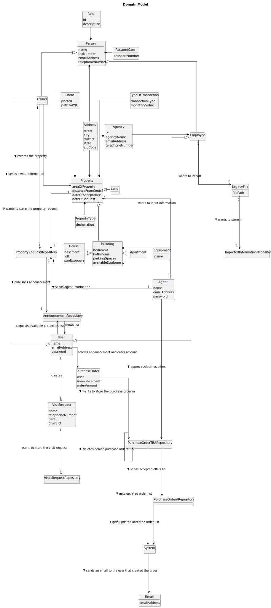

# Analysis

The construction process of the domain model is based on the client specifications, especially the nouns (for
_concepts_) and verbs (for _relations_) used.

## Rationale to identify domain conceptual classes ##

To identify domain conceptual classes, start by making a list of candidate conceptual classes inspired by the list of
categories suggested in the book "Applying UML and Patterns: An Introduction to Object-Oriented Analysis and Design and
Iterative Development".

### _Conceptual Class Category List_ ###

**Business Transactions**

* TypeOfTransaction
* PurchaseOrder

---

**Transaction Line Items**

* House
* Building
* Property
* Land
* Apartment

---

**Product/Service related to a Transaction or Transaction Line Item**

* PropertyRepository
* AnnouncementRepository
* PurchaseOrderTBARepository
* PurchaseOrderARepository
* PurchaseOrderRepository

---

**Roles of People or Organizations**

* Owner
* Agent
* Employee
* Agency Administrator

---

**Places**

* Address

---

**Physical Objects**

* Property
* Building
* House
* Apartment
* Land

---

**Descriptions of Things**

* Photo
* Equipment
* Address
* PassportCard
* Role
* PropertyType
* TypeOfTransaction

---

**Catalogs**

* Property
* Buildings
* House
* Agent
* Employees
* VisitRequests
* PurchaseOrders

---

**Containers**

* AgencyRepository
* AgentRepository
* AnnouncementRepository
* ApartmentRepository
* AuthenticationRepository
* ComissionRepository
* HouseRepository
* LandRepository
* OrganizationRepository
* OwnerRepository
* PersonRepository
* PropertyRepository
* PropertyRequestRepository
* PropertyTypeRepository
* PurchaseOrderTBARepository
* Repositories
* RoleRepository
* TaskCategoryRepository
* VisitsRepository
* VisitsAcceptedRepository
* VisitsRequestRepository

---

**Elements of Containers**

* House
* Land
* Apartment
* Agent
* Owner
* VisitRequest
* PurchaseOrder
* Agency
* Person
* User
* Role

---

**Organizations**

* Agency

---

**Financial Instruments**

* TypeOfTransaction

---

**Documents mentioned/used to perform some work/**

* [NOT MENTIONED]

---

###**Rationale to identify associations between conceptual classes**###

An association is a relationship between instances of objects that indicates a relevant connection and that is worth of
remembering, or it is derivable from the List of Common Associations:

| Concept (A)                | Association                                       | Concept (B)                   |
|----------------------------|---------------------------------------------------|-------------------------------|
| Employee                   | is a                                              | Person                        |
| Employee                   | is a                                              | User                          |                                 |
| Employee                   | wants to import                                   | LegacyFile                    |
| Agency                     | contains                                          | Employee                      |
| User                       | is an                                             | Owner                         |                                 |
| User                       | creates                                           | Property                      |
| User                       | requests available properties list                | AnnouncementRepository        |
| User                       | creates                                           | PurchaseOrder                 |
| Owner                      | is a                                              | Person                        |                                 |
| Owner                      | sends owner information                           | PropertyRequestRepository     |
| Person                     | is a                                              | Role                          |
| Person                     | has a                                             | PassportCard                  |
| Person                     | has a                                             | Address                       |
| Property                   | contains                                          | Land                          |                                 |
| Property                   | has 3 different                                   | PropertyTypes                 |
| Property                   | wants to store the property request               | PropertyRequestRepository     |
| Property                   | contains                                          | Building                      |                                 |
| PropertyRequestRepository  | sends propertyRequest that has been accepted      | AnnouncementRepository        |
| TypeOfTransaction          | describes                                         | Property                      |
| Building                   | contains                                          | House                         |                                 |
| Equipment                  | describes                                         | Building                      |
| Photo                      | describes                                         | Property                      |
| Address                    | describes                                         | Property                      |
| Address                    | describes                                         | Agency                        |
| Apartment                  | is a                                              | Building                      |                                 |
| VisitRequest               | wants to store the visit request in               | VisitsRequestRepository       |
| AnnouncementRepository     | shows list to                                     | User                          |
| PurchaseOrder              | wants to store the purchase order in              | PurchaseOrderTBARepository    |
| Agent                      | approves/declines offers from                     | PurchaseOrderTBARepository    |
| Agent                      | creates                                           | Property                      |
| Agent                      | sends agent information                           | AnnouncementRepository        |
| LegacyFile                 | wants to store files in                           | ImportedInformationRepository |
| PurchaseOrderTBARepository | sends accepted offers to                          | PurchaseOrderARepository      |
| PurchaseOrderTBARepository | gets updated order list                           | System                        |
| PurchaseOrderTBARepository | deletes denied purchase orders                    | PurchaseOrderTBARepository    |
| System                     | sends an email to the user that created the order | Email                         |
| PurchaseOrderARepository   | gets updated accepted order list                  | System                        |

## Domain Model

**Do NOT forget to identify concepts atributes too.**

**Insert below the Domain Model Diagram in a SVG format**

