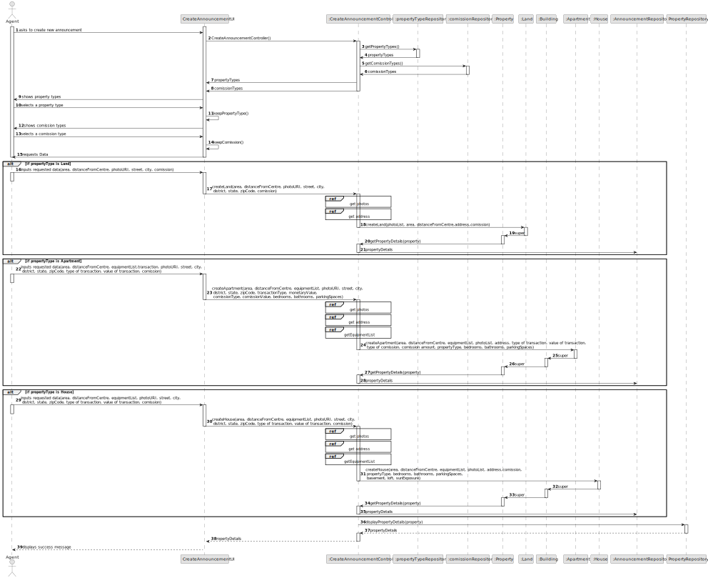
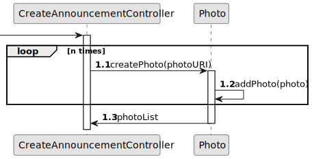
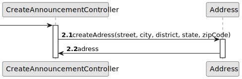
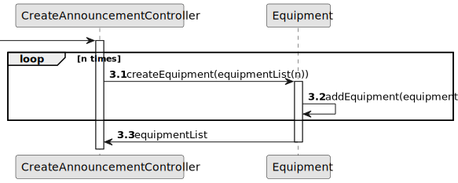
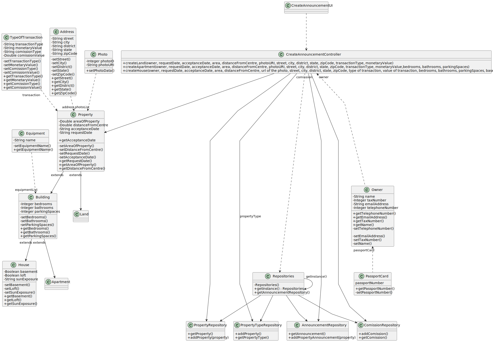

# US 002 - To Create An Announcement

## 3. Design - User Story Realization 

### 3.1. Rationale

**SSD - Alternative 1 is adopted.**

| Interaction ID                            | Question: Which class is responsible for... | Answer                       | Justification (with patterns) |
|:------------------------------------------|:--------------------------------------------|:-----------------------------|:------------------------------|
| Step 1                                    | ... instantiating t                         | AcceptAnnouncementUI         | Pure Fabrication              |
                                                                                                                                                                                                                                                                                                                                                                  | 	         ...informing operation success? | CreateAnnouncementUI                        | Pure fabrication             |                               |

### Systematization ##

According to the taken rationale, the conceptual classes promoted to software classes are: 

 * House
 * Land
 * Apartment
 * Building

Other software classes (i.e. Pure Fabrication) identified: 

 * CreateAnnouncementUI
 * CreateAnnouncementController

## 3.2. Sequence Diagram (SD)

**Sequence Diagram Overview**

**Create photoList**

**Create address**

**Create equipmentList**

## 3.3. Class Diagram (CD)

