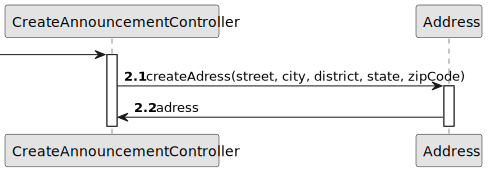

# US 004 - Creating a property listing

## 3. Design - User Story Realization 

### 3.1. Rationale

**SSD - Alternative 1 is adopted.**

| Interaction ID                                                                                                                                                                                                                                                                                                                                                                                                         | Question: Which class is responsible for...                                                      | Answer                 | Justification (with patterns)                     |
|:-----------------------------------------------------------------------------------------------------------------------------------------------------------------------------------------------------------------------------------------------------------------------------------------------------------------------------------------------------------------------------------------------------------------------|:-------------------------------------------------------------------------------------------------|:-----------------------|:--------------------------------------------------|
| Step \ Msg 1 : asks to create a new property listing  		                                                                                                                                                                                                                                                                                                                                                               | 	   ...instantiating the class that handles the UI?                                              | CreateListingUI        | Pure fabrication                                  |
| Step \ Msg 2 : shows the list of agents and asks to choose one                                                                                                                                                                                                                                                                                                                                                         | 	       ...obtaining the list of agents of the agency?                                           | AgentRepository        | Information expert, pure fabrication              |
| 		                                                                                                                                                                                                                                                                                                                                                                                                                     | ... showing the list of agents to the user?                                                      | CreateListingUI        | Pure fabrication                                  |
| 	                                                                                                                                                                                                                                                                                                                                                                                                                      | ...the input the UI will receive?                                                                | Owner                  |                                                   |
| Step \ Msg 3 : chooses an agent		                                                                                                                                                                                                                                                                                                                                                                                      | ...validating the selected agent?	                                                               | CreateListingUI        | Pure fabrication                                  |
| 		                                                                                                                                                                                                                                                                                                                                                                                                                     | ...keeping the selected agent temporarily?                                                       | CreateListingUI        | Pure fabrication                                  |
| Step \ Msg 4 : shows types of property and asks to choose one 		                                                                                                                                                                                                                                                                                                                                                       | ... showing the type of properties to the user?	                                                 | CreateListingUI        | Pure fabrication                                  |
| 	                                                                                                                                                                                                                                                                                                                                                                                                                      | ...obtaining the type of properties?                                                             | PropertyTypeRepository | Information expert, pure fabrication              |
| 	                                                                                                                                                                                                                                                                                                                                                                                                                      | ...the input the UI will receive?                                                                | Owner                  |                                                   |
| Step \ Msg 5 : types requested data (land) 		                                                                                                                                                                                                                                                                                                                                                                          | ...validating the selected type of preperty?                                                     | CreateListingUI        | Pure fabrication                                  |
| 		                                                                                                                                                                                                                                                                                                                                                                                                                     | ...keeping the selected type of property temporarily?	                                           | CreatingListingUI      | Pure fabrication                                  |
| Step \ Msg 6 : requests data about the property 		                                                                                                                                                                                                                                                                                                                                                                     | ...displaying the UI for the owner to input data?                                                | CreatingListingUI      | Pure fabrication                                  |
| Step \ Msg 7 : submits data (type of transaction, value of transaction, the area in m2, the location, the distance from the city centre, the requested price, one or more photographs) 		                                                                                                                                                                                                                              | 	       ...validating the data locally (mandatory data)?                                         | Property               | The information expert has created its own data   |
| 		                                                                                                                                                                                                                                                                                                                                                                                                                     | ...creating the property object?                                                                 | Property               | Creator R:. 1,2                                   |
| 		                                                                                                                                                                                                                                                                                                                                                                                                                     | 	                          ...adding to a collection and globally validating duplicated records? | Property               | The information expert knows all of its instances |
| Step \ Msg 8 : types requested data (apartment) 		                                                                                                                                                                                                                                                                                                                                                                     | ...validating the selected type of preperty?           | CreateListingUI        | Pure fabrication                                  |
| 		                                                                                                                                                                                                                                                                                                                                                                                                                     | ...keeping the selected type of property temporarily?	 | CreatingListingUI      | Pure fabrication                                  |
| Step \ Msg 9 : requests data about the property 		                                                                                                                                                                                                                                                                                                                                                                     | ...displaying the UI for the owner to input data?      | CreatingListingUI      | Pure fabrication                                  |
| Step \ Msg 10 : submits data (type of transaction, value of transaction, the area in m2, the location, the distance from the city centre, the requested price, one or more photographs, the number of bedrooms, the number of bathrooms, the number of parking spaces, the available equipment (such as central heating and/or air conditioning)) 		                                                                    | 	       ...validating the data locally (mandatory data)?                                         | Property               | The information expert has created its own data   |
| 		                                                                                                                                                                                                                                                                                                                                                                                                                     | ...creating the property object?                                                                 | Building               | Creator R:. 1,2                                   |
| 		                                                                                                                                                                                                                                                                                                                                                                                                                     | 	                          ...adding to a collection and globally validating duplicated records? | Building               | The information expert knows all of its instances |
| Step \ Msg 11 : types requested data (house) 		                                                                                                                                                                                                                                                                                                                                                                        | ...validating the selected type of preperty?           | CreateListingUI        | Pure fabrication                                  |
| 		                                                                                                                                                                                                                                                                                                                                                                                                                     | ...keeping the selected type of property temporarily?	 | CreatingListingUI      | Pure fabrication                                  |
| Step \ Msg 12 : requests data about the property 		                                                                                                                                                                                                                                                                                                                                                                    | ...displaying the UI for the owner to input data?      | CreatingListingUI      | Pure fabrication                                  |
| Step \ Msg 13 : submits data (type of transaction, value of transaction, the area in m2, the location, the distance from the city centre, the requested price, one or more photographs, the number of bedrooms, the number of bathrooms, the number of parking spaces, the available equipment (such as central heating and/or air conditioning), the existence of a basement, an inhabitable loft, the sun exposure)	   | 	       ...validating the data locally (mandatory data)?                                         | Property               | The information expert has created its own data   |
| 		                                                                                                                                                                                                                                                                                                                                                                                                                     | ...creating the property object?                                                                 | House                  | Creator R:. 1,2                                   |
| 		                                                                                                                                                                                                                                                                                                                                                                                                                     | 	                          ...adding to a collection and globally validating duplicated records? | House                  | The information expert knows all of its instances |
| Step \ Msg 14 : displays success message	                                                                                                                                                                                                                                                                                                                                                                              | 	         ...informing operation success?                                             | CreateListingUI        | Pure fabrication                                  |

### Systematization ##

According to the taken rationale, the conceptual classes promoted to software classes are: 

 * Repository
 * AgentRepository
 * PropertyRepository
 * PropertyTypeRepository

Other software classes (i.e. Pure Fabrication) identified: 

 * CreateListingUI  
 * CreateListingController

## 3.2. Sequence Diagram (SD)

### Alternative 1 - Full Diagram

This diagram shows the full sequence of interactions between the classes involved in the realization of this user story.

## 3.3. Class Diagram (CD)

