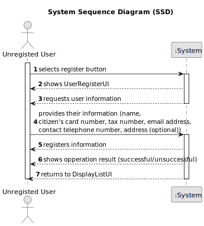

# US 007 - To Register in the System

## 1. Requirements Engineering

### 1.1. User Story Description

As an unregistered user, I want to register in the system to buy, sell or rent
properties.

### 1.2. Customer Specifications and Clarifications

**From the specifications document:**

>	All registered information, except the agency commission, can be accessed by the client who intends to buy or rent the property; the client is, then, responsible for able to consult the properties by type, number of rooms, and sort by criteria such as price or the parish where the property is located.

>   When the client decides to buy/rent the property, he sends a request for the purchase/lease of the property to the agent. After being appreciated by the agent, he accepts or rejects the order. If the request is accepted, the offer will not be shown again to clients using the application.

**From the client clarifications:**

> **Question:** It was previously stated that an unregistered user could do a property listing request. However, with the introduction of US007, I want to clarify and make sure that now a user needs to be registered in order to buy, sell or rent properties, or if they can still do it unregistered. 
>
> **Answer:** In Sprint B we introduce US7 and now, in US4, the owner needs to be registered in the system to submit a request for listing. You should update all artifacts to include this change. 

> **Question:** Does the user also receive the password via email or can he choose a password when registering?
>
> **Answer:** The owner can choose a password when registering.

> **Question:** When an unregistered user wants to register a new account in the system, the set of parameters that are asked are the following: name, citizen card number, tax number, email, phone number, and password. Do you want any extra parameters/requirements to be asked or just the ones specified above? If so, which ones are mandatory?
>
> **Answer:** The Owner attributes are: the name, the citizen's card number, the tax number, the address, the email address and the contact telephone number. The address of the owner is not mandatory.

> **Question:** Can the contract duration be defined as double or float, for example, 1.5 months?
>
> **Answer:** The contract duration is an integer number.

> **Question:** When registering a user, should the application ask if they are registering as a client or an Owner?
>
> **Answer:** No. When registering a user, in US7, we are registering a user that can buy, sell or rent properties. After registering, when this user logins in the system, the user should have access to both owner and client functionalities.

> **Question:** In a question earlier you presented the owner attributes. Does the client have different attributes? 
>
> **Answer:** A owner is also a client of the Real Estate USA company. The attributes are the same. This distinction between owner and client intends to make an association with the type of business. The Owner sells and provides properties for renting and the client buys and rents properties.
Again, when the user (registered in US7) logins in the system, the user should have access to both owner and client functionalities.

> **Question:** When a user registers in the system, does it need to specify for which transactional activities or all registered users can buy sell and rent?
>
> **Answer:** All registered users can buy sell and rent.

> **Question:** After the users fills all the required information, is the user automatically registered in the system, or is there any other role that will review and approve the user registration?
>
> **Answer:** The system should automatically validate the registration.

> **Question:** When a user starts a registration, does the application need to validate if the data is valid (for example: blank text box, email without @, etc)?
>
> **Answer:** Data validation is always a good practice.

> **Question:** What atributes should an unregistered user have?
>
> **Answer:** I already answered this question.

> **Question:** ou said that the owner can choose a password, but how many letters, numbers... it needs to have?
>
> **Answer:** In the Project Description we get: "All those who wish to use the application must be authenticated with a password of seven alphanumeric characters, including three capital letters and two digits". Please read the documentation and clarifications made by the client.

> **Question:** When a user registers in the system, does it need to specify for which transactional activities or all registered users can buy sell and rent?
>
> **Answer:** All registered users can buy sell and rent.

> **Question:** After the users fills all the required information, is the user automatically registered in the system, or is there any other role that will review and approve the user registration?
>
> **Answer:** The system should automatically validate the registration.

> **Question:** When a user starts a registration, does the application need to validate if the data is valid (for example: blank text box, email without @, etc)?
>
> **Answer:** Data validation is always a good practice.

> **Question:** As the Owner and the Client have the same functionalities, can these profiles be replaced by a single profile, called User, which encompasses both?
>
> **Answer:** This is not a question for the client. Please discuss this question with your team and ESOFT teatchers.

> **Question:** Regarding US002, the client previously stated that if the announcement is made through a phone call between the Owner and the agent, the Owner´s information wasn't needed, and therefore it wasn't recorded in the system. My question is whether this decision still applies even with the introduction of US007 (client/user registration)?
>
> **Answer:** I already clarified this point: "The agent should identify, in the system, the owner that wants to sell a property. The agent should use the owner e-mail address to identify the owner. The owner who is contacting the agent (for example, through a phone call) must be registered in the system. The agent that receives the phone call is the property responsible agent."

### 1.3. Acceptance Criteria

* **AC1:** The name has to be written.
* **AC2:** The citizen's card number has to be valid.
* **AC3:** The tax number has to be valid.
* **AC4:** The email has to be valid.
* **AC5:** The telephone number has to be valid.
* **AC6:** The password has to be valid.

### 1.4. Found out Dependencies

* There is a dependency to "As an unregistered user, I want to display listed properties" as it also acts as an unregistered user.
* There is a dependency to "US4 As an owner, I intend to submit a request for listing a property sale or rent,
  choosing the responsible agent" as it needs to exist a property in order to be bought, sold or rented.

### 1.5 Input and Output Data

**Input Data:**

* Typed data:
  * Name 
  * Citizen's card number 
  * Tax number
  * Email address  
  * Contact telephone number
  * Address (optional)

**Output Data:**

* Operation Result (Successful/Unsuccessful)

### 1.6. System Sequence Diagram (SSD)

### 1.7 Other Relevant Remarks

None at the moment.