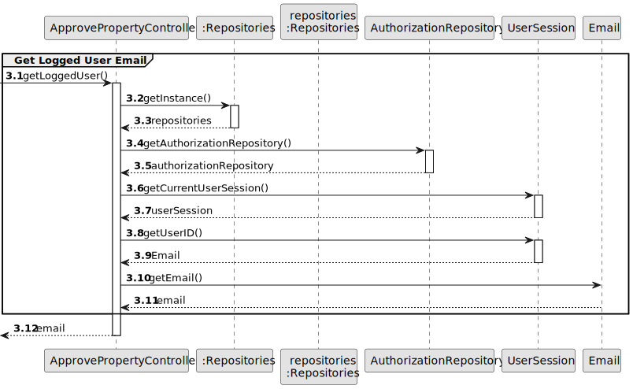
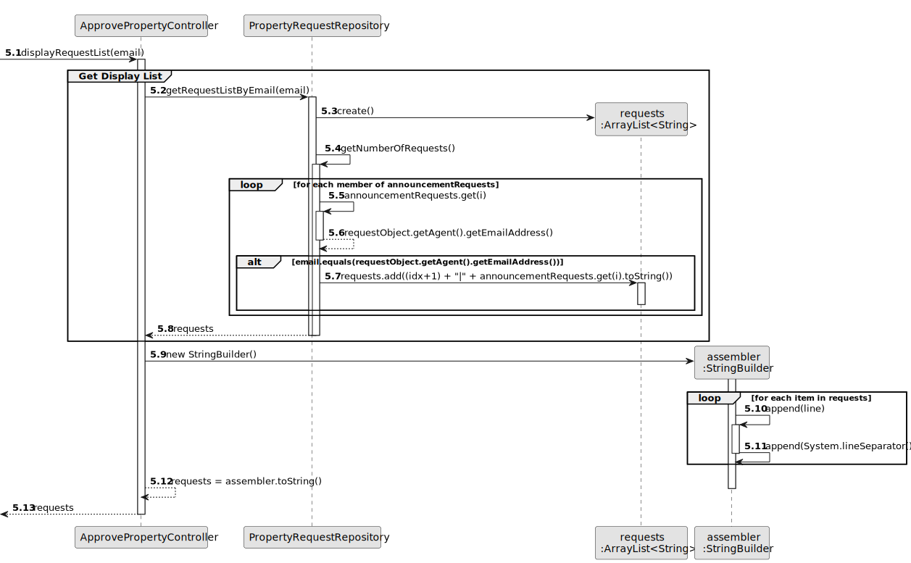
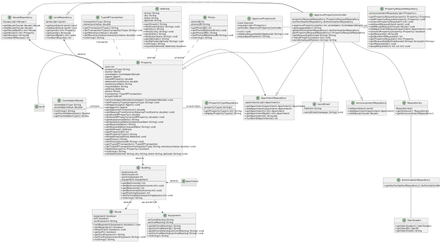

# US 008 - To Approve An Announcement Request

## 3. Design - User Story Realization 

### 3.1. Rationale

**SSD**

| Interaction ID                                               | Question: Which class is responsible for...                                | Answer                    | Justification (with patterns) |
|:-------------------------------------------------------------|:---------------------------------------------------------------------------|:--------------------------|:------------------------------|
| Step 1 - asks to receive the list of announcement requests   | ... instantiating the Controller   ?                                       | AprovePropertyUI          | Pure Fabrication              |
|                                                              | ... coordinating the US                                                    | ApprovePropertyController | Controller                    |
|                                                              | ... knowing which user is using the system ?                               | UserSession               | Pure Fabrication              |
|                                                              | ... temporarily keeping the User Session ?                                 | ApprovePropertyController | Pure Fabrication              |
|                                                              | ... getting the User ID ?                                                  | UserSession               | Pure Fabrication              |
|                                                              | ... temporarily keeping the User ID ?                                      | ApprovePropertyController | Pure Fabrication              |
|                                                              | ... getting the UserSession ?                                              | UserSession               | Pure Fabrication              |
|                                                              | ... sorting the property request list in the property request repository ? | ApprovePropertyController | Pure Fabrication              |
|                                                              | ... temporarily keeping the UserSession ?                                  | ApprovePropertyController | Pure Fabrication              |
| Step 2 - shows the list of properties and asks to select one | ... displaying the announcement requests               ?                   | ApprovePropertyUI         | Pure Fabrication              |
| Step 3 - selects a property                                  | ... displaying the property details      ?                                 | ApprovePropertyUI         | Pure Fabrication              |
|                                                              | ... temporarily storing the option        ?                                | ApprovePropertyUI         | Pure Fabrication              |
|                                                              | ... getting the propertyID                 ?                               | ApprovePropertyController | Pure Fabrication              |
|                                                              | ... temporarily storing the propertyID  ?                                  | ApprovePropertyController | Pure Fabrication              |
| Step 4 - displays property details                           | ... displaying the property details         ?                              | AprovePropertyUI          | Pure Fabrication              |
| Step 5 - asks for acceptance                                 | ... displaying the acceptance options   ?                                  | ApprovePropertyUI         | Pure Fabrication              |
| Step 6 - inputs acceptance                                   | ... temporarily storing the acceptance   ?                                 | ApprovePropertyUI         | Pure Fabrication              |

**SSD - alternative 1 is adopted**

| Interaction ID                                               | Question: Which class is responsible for...                    | Answer                    | Justification (with patterns) |
|:-------------------------------------------------------------|:---------------------------------------------------------------|:--------------------------|:------------------------------|
| Step 7 - asks for justification                              | ... displaying the justification request                       | ApprovePropertyUI         | Pure Fabrication              |
| Step 8 - inputs requested data                               | ... temporarily storing the justification       ?              | ApprovePropertyUI         | Pure Fabrication              |
|                                                              | ... temporarily storing the acceptance           ?             | ApprovePropertyUI         | Pure Fabrication              |
|                                                              | ... getting the propertyID                        ?            | ApprovePropertyController | Pure Fabrication              |
|                                                              | ... removing the Property from the PropertRequestRepository ?  | ApprovePropertyController | Pure Fabrication              |
|                                                              | ... sending the justification message                        ? | SendEmail                 | Pure Fabrication              |

**SSD** - alternative 2 is adopted

| Interaction ID                                               | Question: Which class is responsible for...                                 | Answer                    | Justification (with patterns) |
|:-------------------------------------------------------------|:----------------------------------------------------------------------------|:--------------------------|:------------------------------|
| Step 9 - displays and asks for comission type                | ... displaying the commission type                              ?           | ApprovePropertyUI         | Pure Fabrication              |
| Step 10 - inputs requested data                              | ... temporarily storing the comission types                    ?            | ApprovePropertyUI         | Pure Fabrication              |
| Step 11 - displays and asks for comission value              | ... displaying the commission values                            ?           | ApprovePropertyUI         | Pure Fabrication              |
| Step 12 - inputs requested data                              | ... temporarily storing the commission amount                   ?           | ApprovePropertyUI         |                               |
|                                                              | ... creating the commission object ?                                        | ApprovePropertyController | Pure Fabrication              |
|                                                              | ... getting object through the ID                                 ?         | ApprovePropertyController | Pure Fabrication              |
|                                                              | ... temporarily storing the object                                 ?        | ApprovePropertyController | Pure Fabrication              |
|                                                              | ... setting the commission details                                  ?       | ApprovePropertyController | Pure Fabrication              |
|                                                              | ... adding the object to the announcement repository                 ?      | ApprovePropertyController | Pure Fabrication              |
|                                                              | ... removing the object from the property request repository          ?     | ApprovePropertyController | Pure Fabrication              |
| Step 13 - displays status messages                           | ... displaying the status message                                         ? | ApprovePropertyUI         | Pure Fabrication              |

### Systematization ##

According to the taken rationale, the conceptual classes promoted to software classes are: 

 * User
 * AuthenticationRepository
 * Property
 * Land
 * House
 * Apartment

Other software classes (i.e. Pure Fabrication) identified: 

 * ApproveProperty Controller
 * ApprovePropertyUI
 * Email
 * UserSession
 * CommissionDetails

## 3.2. Sequence Diagram (SD)

### Alternative 1 - Full Diagram

This diagram shows the full sequence of interactions between the classes involved in the realization of this user story.

### Alternative 2 - Partial Diagrams

These diagrams show the interactions referenced in the SD Full Diagram 

## 3.3. Class Diagram (CD)

