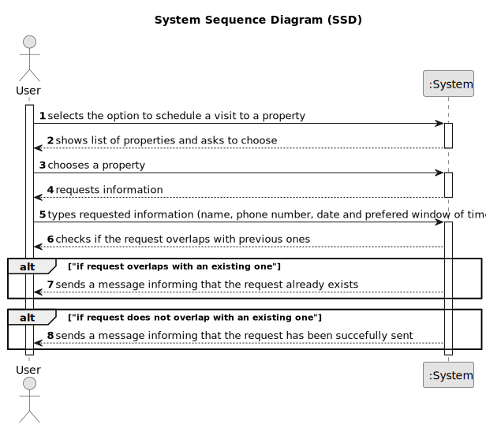

# US 009 - Messaging for a visit

## 1. Requirements Engineering

### 1.1. User Story Description

As a client, I want to leave a message to the agent to schedule a visit to a property of my interest.

### 1.2. Customer Specifications and Clarifications

**From the specifications document:**

>	After consulting a list of properties, the client can request to schedule a visit to the real estate agent
for a specific property to verify its conditions. The agent receives the request, checks the
availability and sends the response. If the customer accepts the order, it is automatically scheduled
in the system.
**From the client clarifications:**

**From the client clarifications:**

> **Question:** Can the customer visit the same property more than once?
> 
> **Answer:** A client may post multiple visit requests, but only if those do not overlap each other. In this US the client is only scheduling a visit to a property. In the beginning of Sprint D we will introduce more USs.
 
 > **Question:** When the user story says that the agent verifies the property availability, its for the program to do the verification or there must be a real interaction between the two actors? Quote from the document: "The agent receives the request, checks the availability and sends the response. If the customer accepts the order, it is automatically scheduled in the system."
>
> **Answer:** This quote is not from US9...Please be careful and rigorous!
 
 > **Question:** Does the client provide (by typing) their name and phone number for the message, regardless of whether or not that information is already available to the system?
>
> **Answer:** The information available in the system should be used. The client does not need to type the name and phone number.
 
 > **Question:** Is all the required data for the message typed, or is any of it selected?
>
> **Answer:** For now the information should be typed.

 > **Question:** In the message what is the characteristic to identify the property to visit? Can we use the location?
>
> **Answer:** The message should be associated with a property. Please check AC1. The client should select a property that he wants to visit before making the visit request.
 
> **Question:** When sending the message, is the visit immediately scheduled after being validated by the system, or is it necessary for the agent to approve it?
>
> **Answer:** No, the client is only making a visit request.

> **Question:** Should the scheduling be limited to a time interval ? e.g 08:00 - 20:00 ?
> 
> **Answer:** No.

> **Question:** On US9 AC1 it is says: "AC1. A list of available properties must be shown, sorted from the most recent entries to the oldest." Does this mean that we can only have the option to make contact in this type of sort?
>
> **Answer:** No. AC1 is the default sorting method.

> **Question:** When we list in another way, should not be possible to have the option to schedule a visit?
>
> **Answer:** After sorting the properties, the cliente can still schedule a visit.

> **Question:** Assuming that this is done so the client can see the available properties in order to select one and given that in a previous question you've stated that the required information for the message should be typed then, for this US, is the only selected data the property that the client wishes to visit?
>
> **Answer:** System behavior must be consistent. For instance, the filters to be applied when the client is viewing a list of properties should be similar to the filters used in US1.

> **Question:** Can the customer visit the same property more than once?
>
> **Answer:** A client may post multiple visit requests, but only if those do not overlap each other. In this US the client is only scheduling a visit to a property. In the beginning of Sprint D we will introduce more USs.

### 1.3. Acceptance Criteria

* **AC1:** A list of available properties must be shown, sorted from the most recent entries to the oldest.
* **AC2:** The message must also include the client's name, phone number, preferred date and time slot (from x hour to y hour) for the property visit.
* **AC3:** A client may post multiple visit requests, but only if those do not overlap each other.
* **AC4:** The client must receive a success message when the request is valid and registered in the system.

### 1.4. Found out Dependencies

* [NO DEPENDENCIES]

### 1.5 Input and Output Data

**Input Data:**

* Typed data:
  * User data
  * Property of your choosing
  * Prefered date
  * Prefered time slot

**Output Data:**

* Operation Result (Successful/Unsuccessful)

### 1.6. System Sequence Diagram (SSD)

### 1.7 Other Relevant Remarks

None at the moment.