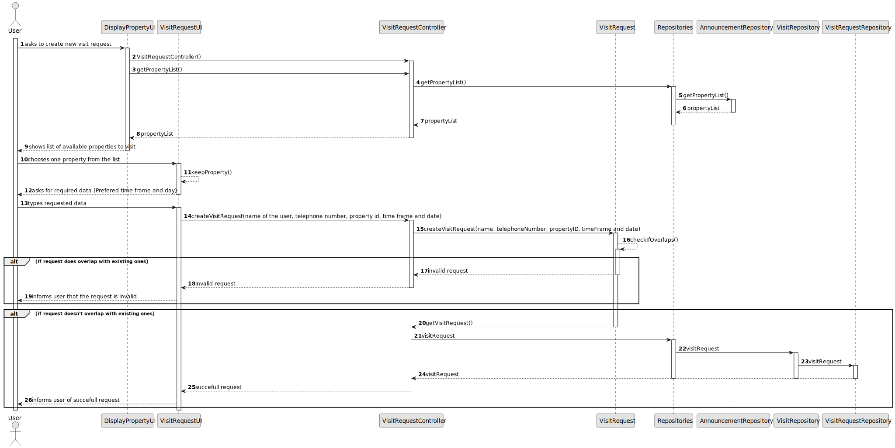
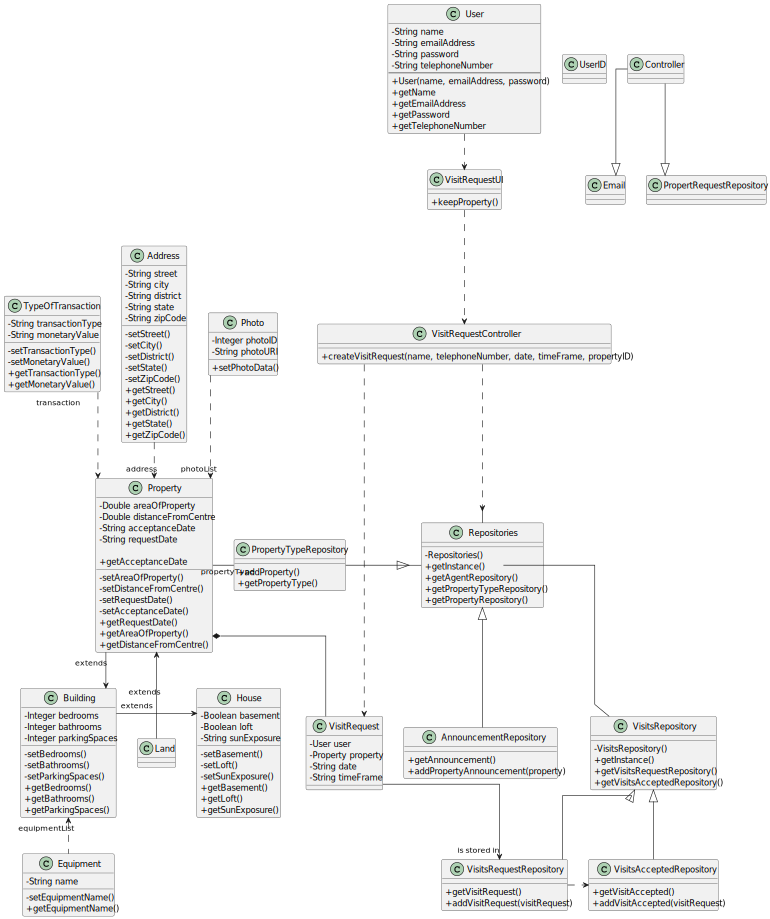

# US 009 - Messaging for a visit 

## 3. Design - User Story Realization 

### 3.1. Rationale

**SSD - Alternative 1 is adopted.**

| Interaction ID                                                                                                                                                                                                                                                                                                                                                                                                                                                     | Question: Which class is responsible for...                    | Answer                     | Justification (with patterns)        |
|:-------------------------------------------------------------------------------------------------------------------------------------------------------------------------------------------------------------------------------------------------------------------------------------------------------------------------------------------------------------------------------------------------------------------------------------------------------------------|:---------------------------------------------------------------|:---------------------------|:-------------------------------------|
| Step \ Msg 1 : asks to schedule a visit                                                                                                                                                                                                                                                                                                                                                                                                                            | ...choosing the option to schedule a visit?                    | *User*                     | Pure Fabrication                     |
|                                                                                                                                                                                                                                                                                                                                                                                                                                                                    | 	   ...instantiating the class that handles the UI?            | DisplayPropertyListUI      | Pure fabrication                     |
| Step \ Msg 2: shows list of properties and asks to choose		                                                                                                                                                                                                                                                                                                                                                                                                        | 	...showing the list of properties                             | *DisplayPropertyListUI*    | Pure Fabrication                     |
|                                                                                                                                                                                                                                                                                                                                                                                                                                                                    | ...showing the option to ask for a scheduled visit?            | *DisplayPropertyListUI*    | Pure Fabrication                     |
| Step \ Msg 3: chooses a property                                                                                                                                                                                                                                                                                                                                                                                                                                   | ...who is responsible for choosing the property?               | *User*                     | Information Expert                   |
|                                                                                                                                                                                                                                                                                                                                                                                                                                                                    | ...validating the choosen property?                            | *DisplayPropertyListUI*    | Pure Fabrication                     ||                                                               |                                                             |                          |                                                             |
| 		                                                                                                                                                                                                                                                                                                                                                                                                                                                                 | ...keeping the selected property temporarily?                  | *VisitRequestUI*           | Information Expert                   |
| Step \ Msg 4: requests information                                                                                                                                                                                                                                                                                                                                                                                                                                 | ...displaying the UI for the User to input data?               | *VisitRequestUI*           | Pure fabrication                     |
| Step \ Msg 5: types requested information (name, phone number, date and prefered window of time) 	                                                                                                                                                                                                                                                                                                                                                                 | ...checking if the request doesn't overlap with existing ones? | *VisitRequestUI*           | Pure fabrication                     |
| Step \ Msg 6: checks if the request overlaps with previous ones		                                                                                                                                                                                                                                                                                                                                                                                                  | 	...holding all the visit requests that exist already?         | *VisitsAcceptedRepository* | Information Expert                   | 
|                                                                                                                                                                                                                                                                                                                                                                                                                                                                    | ... creating a new visit request?                              | *VisitRequest*             | Pure Fabrication                     |
|                                                                                                                                                                                                                                                                                                                                                                                                                                                                    | ... storing the visit request?                                 | *VisitRequestRepository*   | Information Expert, Pure Fabrication |
| Step \ Msg 7: sends a message informing that the request already exists		                                                                                                                                                                                                                                                                                                                                                                                          | 	... knowing the operation success?                            | *VisitRequestController*   | Pure Fabrication                     | 
|                                                                                                                                                                                                                                                                                                                                                                                                                                                                    | ... informing the opperation success?                          | *VisitRequestUI*           | Pure Fabrication                     |
| Step \ Msg 8: sends a message informing that the request has been succefully sent 		                                                                                                                                                                                                                                                                                                                                                                               | 	... knowing the operation success?                            | *VisitRequestController*   | Pure Fabrication                     | 
|                                                                                                                                                                                                                                                                                                                                                                                                                                                                    | ... informing the opperation success?                          | *VisitRequestUI*           | Pure Fabrication                     |

### Systematization ##

According to the taken rationale, the conceptual classes promoted to software classes are: 

 * User
 * VisitRepository
 * VisitRequestRepository
 * VisitsAcceptedRepository

Other software classes (i.e. Pure Fabrication) identified: 

 * VisitRequestUI
 * DisplayPropertyListUI
 * VisitRequestController

## 3.2. Sequence Diagram (SD)

### Alternative 1 - Full Diagram

This diagram shows the full sequence of interactions between the classes involved in the realization of this user story.

## 3.3. Class Diagram (CD)

