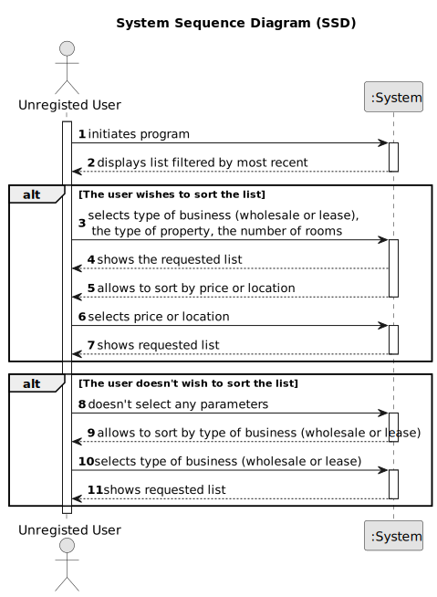

# US 001 - To Display Listed Properties

## 1. Requirements Engineering

### 1.1. User Story Description

As an unregistered user, I want to display listed properties.

### 1.2. Customer Specifications and Clarifications

**From the specifications document:**

>	All registered information, except the agency commission, can be accessed by the client who intends to buy or rent the property; the client is, then, responsible for able to consult the properties by type, number of rooms, and sort by criteria such as price or the parish where the property is located.

>   When the client decides to buy/rent the property, he sends a request for the purchase/lease of the property to the agent. After being appreciated by the agent, he accepts or rejects the order. If the request is accepted, the offer will not be shown again to clients using the application.

**From the client clarifications:**

> **Question:** The properties can be in sale and lease at the same time?
>
> **Answer:** No.

> **Question:** An unregistered user can only see sale announcements or is he able to contact the agency agents to make a purchase request?
>
> **Answer:** From the project description: "As an unregistered user, I want to display listed properties". For now this is the only functionality of the system that the non-registered user can use.

> **Question:** In the project description it is stated that "the client is, then, responsible for being able to consult the properties by type, number of rooms, and sort by criteria such as price or the parish where the property is located.". Is the client able to sort properties by only these 4 criteria or is he able to sort properties by any of the properties' characteristics?
>
> **Answer:** The client should be able to select the type of business (renting or buying), the type of property and the number of rooms. Then, the client should be able to sort properties by price or by parish where the property is located. If the client does not select the type of business, the type of property and the number of rooms, the application should allow the client to sort all properties that are on sale or on renting.

> **Question:** When an unregistered user wants to list properties, the list given by the program is sorted by default with which criteria? For example the list is shown with the properties sorted by most recently added?
>
> **Answer:** Thank you for your suggestion. By default, the list should be shown with the properties sorted by most recently added.

> **Question:** Can a user filter the properties list for example by a type but choosing multiple values? For example the users wants to see only properties with 3 or 4 rooms. If this is possible, after filtering the list to show only the values chosen, he can sort by ascending/descending?
> 
> **Answer:** The user should select only one value for each feature of the property. By default, the list should be shown with the properties sorted by most recently added.

> **Question:**  In a previous question, you answered that, regarding US001 filtering/sorting system, the client should be able to select (from a list) the type of business, the type of property, and the number of rooms. Does this apply too to the process of an owner submitting a request? Or does the owner has to type these characteristics?
> 
> **Answer:** Yes.

> **Question:** When sorting by price or location: 1) Does it mean ascending or descending? Most expensive to least expensive or vice-versa. By closest to furthest or vice-versa. 2) To filter between a range of price? 3) To filter the location of the property by city?
> 
> **Answer:** The client should be able to sort (ascending or descending) properties by price, city and state. I do not want the filters that you are suggesting.

> **Question:** The order which the properties are sorted by default is an ascending (for price from lowest to highest and for parish from A to Z) or in a descending order?
>
> **Answer:** The client should be able to sort (ascending or descending) properties by price, city and state. By default, the list should be shown with the properties sorted by most recently added.

> **Question:** Can a land be rented? 
>
> **Answer:** Yes. Please read the Project Description carefully.

> **Question:** In the project's documentation it's mentioned that "All those who wish to use the application must be authenticated", but in the US1 it's said that an unregistered user can see a list of properties. Can users who aren't authenticated do this?
>
> **Answer:** Non-authenticated users can only list properties.

> **Question:** The one of the search criteria is "number of rooms". Is "Number of Bedrooms" or "Number of Bathrooms" or both?
>
> **Answer:** Number of Bedrooms.

> **Question:** The property size, location and type are typed or selected in order to filter the results?
>
> **Answer:** I think you are asking about US1. The client should be able to select (from a list) the type of business, the type of property and the number of rooms.

> **Question:** The act of publishing a sale announcement means that the agent is publishing a new property for sale in the system (receiving the information of the seller and publishing the new property for sale) or is it the buyer giving positive feedback to the agent with intent to buy the property(actually closing a sale, buying a property and de-listing said property)?
>
> **Answer:** In US1 we get "As an agent, I can publish any sale announcement on the system, for example received through a phone call". Additional information related with this question is also avaliable in the project description. Asking the customer something that is clear or has already been clarified is unprofessional.

> **Question:** Does a rent request includes a contract duration (minimum or defined)?
>
> **Answer:** The caracteristics for a rental are the same as the ones for the sale of a property. The rent value is per month. Additionally, we have to define the contract duration. Ther is no minimum.

> **Question:** Does the "Land" property type, have specific attributes, that justify the creation of the "Land" concept?
>
> **Answer:** The attributes of a land property type are described in the initial Project Description. I am a client, not a software engineering.
 

### 1.3. Acceptance Criteria

* **AC1:** All the properties must be available to be displayed.
* **AC2:** All the information of the property must be included to be approved.
* **AC3:** All the information must be approved to be displayed.

### 1.4. Found out Dependencies

* There is a dependency to US04 "As an owner, I intend to submit a request for listing a property sale or rent,
  choosing the responsible agent" as it needs to exist a property in order to be listed.
* This also creates the dependency to US08 "As an agent, I intend to see the list of property announcement requests made
  to myself, so that I can post the announcement" as the property needs to be approved.

### 1.5 Input and Output Data

**Input Data:**

* Typed data:
	* None required.

* Selected data:
    * The type of business (renting or buying);
    * The type of property;
    * The number of rooms.
    * The address;
    * The type of price sorting;
    * Displaying listed properties;

**Output Data:**

* List of available properties with:
	* The type of property (apartment, house or land);
	* The area in m2;
	* The location;
	* The distance from the city centre;
	* The request price;
	* Photographs;
	* The number of bathrooms;
	* The number of parking spaces;
	* The available equipment;
	* Central heating and/or air conditioning;
	* The existence of a basement;
	* The existence of an inhabitable loft;
	* The sun exposure;

### 1.6. System Sequence Diagram (SSD)

### 1.7 Other Relevant Remarks

None at the moment.