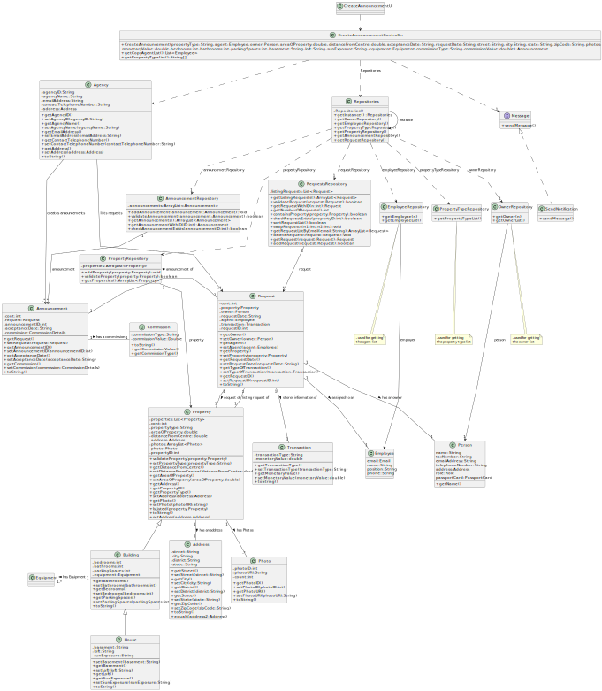

# US 002 - To Create An Announcement

## 3. Design - User Story Realization 

### 3.1. Rationale

**SSD - Alternative 1 is adopted.**

| Interaction ID                                          | Question: Which class is responsible for...        | Answer                       | Justification (with patterns)                                                                                 |
|:--------------------------------------------------------|:---------------------------------------------------|:-----------------------------|:--------------------------------------------------------------------------------------------------------------|
| Step 1: asks to create a new announcement               | ... interacting with the actor                     | CreateAnnouncementUI         | Pure Fabrication: there is no reason to assign this responsibility to any existing class in the Domain Model. |
|                                                         | ... coordinating the US                            | CreateAnnouncementController | Controller                                                                                                    |
| Step 2: shows property type list and asks to select one | ... showing property type list                     | CreateAnnouncementUI         | Pure Fabrication                                                                                              |
|                                                         | ... knowing the available property types           | PropertyTypeRepository       | Information Expert                                                                                            |
|                                                         | ... validating the input data                      | CreateAnnouncementUI         | Pure Fabrication                                                                                              |
| Step 3: selects property type                           | ... temporarily storing the selected property type | CreateAnnouncementUI         | Pure Fabrication                                                                                              |
| Step 4: shows list of agents and asks to select one     | ... showing list of agents                         | CreateAnnouncementUI         | Pure Fabrication                                                                                              |
|                                                         | ... knowing the available agents                   | EmployeeRepository           | Pure Fabrication                                                                                              |
|                                                         | ... validating the input data                      | CreateAnnouncementUI         | Pure Fabrication                                                                                              |
| Step 5: selects agent                                   | ... temporarily storing the agent option           | CreateAnnouncementUI         | Pure Fabrication                                                                                              |
| Step 6: requests data                                   | ... displaying data request                        | CreateAnnouncementUI         | Pure Fabrication                                                                                              |
|                                                         | ... validating the input data                      | CreateAnnouncementUI         | Pure Fabrication                                                                                              |
| Step 7: inputs data                                     | ... temporarily storing the data                   | CreateAnnouncementUI         | Pure Fabrication                                                                                              |
| Step 8: requests photoURI for each photo                | ... requesting photoURI                            | CreateAnnouncementUI         | Pure Fabrication                                                                                              |
| Step 9: inputs requested data                           | ... temporarily storing the data                   | CreateAnnouncementUI         | Pure Fabrication                                                                                              |
| Step 10: requests Equipment                             | ... requesting the equipment name                  | CreateAnnouncementUI         | Pure Fabrication                                                                                              |
| Step 11: inputs requested data                          | ... temporarily storing the data                   |                              |                                                                                                               |
|                                                         | ... instantiating the Equipment object             | Building                     | Pure Fabrication                                                                                              |
| Step 12: requests data                                  | ... requesting additional data for "Apartment"     | CreateAnnouncementUI         | Pure Fabrication                                                                                              |
|                                                         | ... validating the input data                      | CreateAnnouncementUI         | Pure Fabrication                                                                                              |
| Step 13: inputs requested data                          | ... temporarily storing the requested data         | CreateAnnouncementUI         | Pure Fabrication                                                                                              |
|                                                         | ... validating the input data                      | CreateAnnouncementUI         | Pure Fabrication                                                                                              |
| Step 14: requests data                                  | ... requesting additional data for "House"         | CreateAnnouncementUI         | Pure Fabrication                                                                                              |
|                                                         | ... validating the input data                      | CreateAnnouncementUI         | Pure Fabrication                                                                                              |
| Step 15: inputs requested data                          | ... temporarily storing requested data             | CreateAnnouncementUI         | Pure Fabrication                                                                                              |
| Step 16: requests data                                  | ... requesting data for transaction                | CreateAnnouncementUI         | Pure Fabrication                                                                                              |
|                                                         | ... validating the input data                      | CreateAnnouncementUI         | Pure Fabrication                                                                                              |
| Step 17: inputs requested data                          | ... temporarily storing the requested data         | CreateAnnouncementUI         | Pure Fabrication                                                                                              |
| Step 18: shows owner list and asks to select one        | ... displaying the owner list                      | CreateAnnouncementUI         | Pure Fabrication                                                                                              |
|                                                         | ... validating the input data                      | CreateAnnouncementUI         | Pure Fabrication                                                                                              |
| Step 19: selects owner                                  | ... temporarily storing the data                   | CreateAnnouncementUI         | Pure Fabrication                                                                                              |
|                                                         | ... knowing the available owners                   | OwnerRepository              | Pure Fabrication                                                                                              |
|                                                         | ... obtaining the property type from the option    | CreateAnnouncementController | Pure Fabrication                                                                                              |
|                                                         | ... creating the property/building/house object    | Agency                       | Pure Fabrication                                                                                              |
|                                                         | ... creating the Request object                    | Agency                       | Pure Fabrication                                                                                              |
|                                                         | ... creating the Announcement object               | Agency                       | Pure Fabrication                                                                                              |
|                                                         | ... creating the notification file                 | SendEmail                    | Pure Fabrication                                                                                              |
| Step 20: displays operation success                     | ... displaying operation success                   | CreateAnnouncementUI         | Pure Fabrication                                                                                              |

### Systematization ##

According to the taken rationale, the conceptual classes promoted to software classes are: 

 * Agency
 * Building
 * House
 * Property

Other software classes (i.e. Pure Fabrication) identified: 

 * CreateAnnouncementUI
 * CreateAnnouncementController
 * PropertyTypeRepository
 * EmployeeRepository
 * OwnerRepository
 * Message

## 3.2. Sequence Diagram (SD)

**Sequence Diagram Overview**

## 3.3. Class Diagram (CD)

