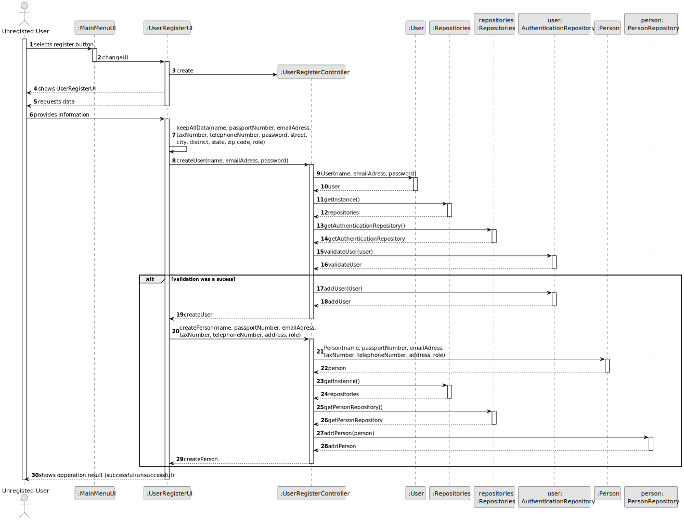
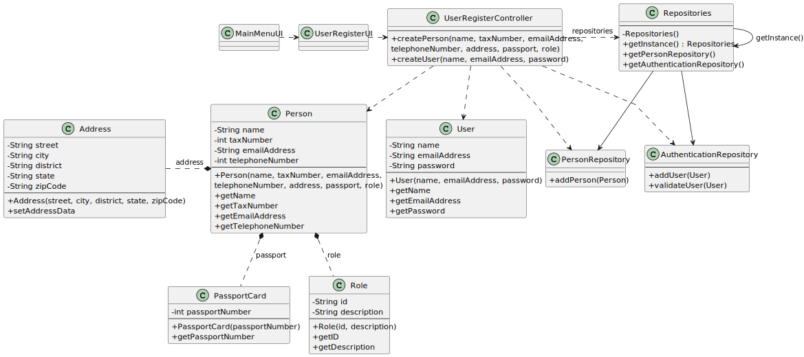

# US 007 - To Register an User 

## 3. Design - User Story Realization 

### 3.1. Rationale

**SSD - Alternative 1 is adopted.**

| Interaction ID                                               | Question: Which class is responsible for...                 | Answer                   | Justification (with patterns) |
|:-------------------------------------------------------------|:------------------------------------------------------------|:-------------------------|:------------------------------|
| Step 1: shows UserLoginUI                                    | ... displaying the user login UI?                           | *MainMenuUI*             | Pure Fabrication              |
| Step 2: selects register button 		                           | 	... displaying the register button?                        | *MainMenuUI*             | Pure Fabrication              |
| Step 3: shows UserRegisterUI                                 | ... displaying the user register UI?                        | *UserRegisterUI*         | Pure Fabrication              |
|                                                              | ... coordinating the UserRegisterUI and this US?            | *UserRegisterController* | Pure Fabrication              ||                                                               |                                                             |                          |                                                             |
| Step 4: requests data                                        | ... displaying the user register UI?                        | *UserRegisterUI*         | Pure Fabrication              |
| Step 5: provides their information  		                       | 	... temporarily keeping the input data?                    | *UserRegisterUI*         | Pure Fabrication              | 
| Step 6: registers information 		                             | 	... having the registered data?                            | *UserRegisterUI*         | Pure Fabrication              | 
|                                                              | ... sending the registered data?                            | *UserRegisterController* | Pure Fabrication              |
|                                                              | ... creating a user?                                        | User                     | Creator                       |
|                                                              | ... validating the user (if its a duplicate)?               | AuthenticationRepository | Pure Fabrication              |
|                                                              | ... storing the user created?                               | AuthenticationRepository | Pure Fabrication              |
|                                                              | ... creating and validating a person?                       | Person                   | Creator                       |
|                                                              | ... storing the person created?                             | PersonRepository         | Pure Fabrication              |
| Step 7: shows opperation result (successful/unsuccessful) 		 | 	... knowing the operation success?                         | *UserRegisterController* | Pure Fabrication              | 
|                                                              | ... informing the opperation success?                       | *UserRegisterUI*         | Pure Fabrication              |

### Systematization ##

According to the taken rationale, the conceptual classes promoted to software classes are: 

 * User
 * AuthenticationRepository
 * Person
 * PersonRepository

Other software classes (i.e. Pure Fabrication) identified: 

 * MainMenuUI
 * UserRegisterUI
 * UserRegisterController

## 3.2. Sequence Diagram (SD)

### Alternative 1 - Full Diagram

This diagram shows the full sequence of interactions between the classes involved in the realization of this user story.

## 3.3. Class Diagram (CD)

