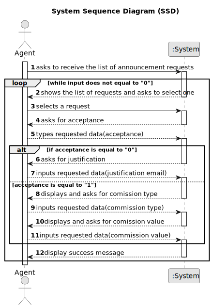

# US 008 - To Approve an Announcement Request

## 1. Requirements Engineering

### 1.1. User Story Description

As an agent, I intend to see the list of property announcement requests made
to myself, so that I can post the announcement.

### 1.2. Customer Specifications and Clarifications

**From the specifications document:**

> Nothing specified

**From the client clarifications:**

> **Question**: About US08, since as an agent I intend to see the advertisement requests made to me in order to publish the chosen advertisement after consulting the list, why should there be an option to reject it since the previously chosen advertisement had already the intention of being published.The rejection operation shouldn't be described as another feature?
>
> **Answer**: I want to check all property announcement requests and have the option to accept or reject any announcement request. The property owner is a human being and can make errors like any other human being..

> **Question**: Besides the creation of a message justifiyng the rejection should a message or an email be sent to the client.
>
> **Answer**: The system should also send the message to the owner by e-mail.

> **Question**: Does the request once its declined by the agent be deleted from the request list?
>
> **Answer**: The announce request should not be shown again to the agent. We never delete information from our system.

> **Question** Do the agent have to insert the commission after accepting the request from the request list?
>
> **Answer**: The agent should, firstly, set the commission and then publishes the offer in the system. The sale price (the USD value that is shown in the announcement) should include the commission value (owner requested price + commission) and should not show the commission. The commission is only specified when the agent accepts the request.

> **Question** Is the owner responsible to assigning the property to an agent or there are other ways to do that?
>
> **Answer**: In US8 we get "As an agent, I intend to see the list of property announcement requests made to myself, so that I can post the announcement". In this US the agent is the actor.

> **Question**: Regarding US008, can the agent decline an announcement request?
> 
> **Answer**: Yes. The agent must include a message justifying the rejection.

> **Question**: Can the agent select multiple requests at the same time?
> 
> **Answer**: No. The agent can only post one announcement at a time.

> **Question** : When displaying the property announcement requests in the system to the agent besides them being ordered from most recent to oldest is there a need to display the specific day where the requests were published?
> 
> **Answer** : The list of property announcement requests should be sorted by the date they were created, with the most recent requests appearing first. The system should show the date when the property announcement requests was made.

### 1.3. Acceptance Criteria

* **AC1:** The requests must be ordered from most recent to oldest.
* **AC2:** The list of requests must be refreshed after the announcement is posted.

### 1.4. Found out Dependencies

* There is a dependency to "US4 As an owner, I intend to submit a request for listing a property sale or rent,
  choosing the responsible agent" as the property listing must be done correctly for the approval of the announcement to go smoothly.
* There is a dependency to "US003 To register a new employee", relative to agent logged in, since only he can view his requested properties.

### 1.5 Input and Output Data

**Input Data:**

* Typed data:
  * Option
  * Acceptance
  * Comission Value
  * Comission Type
  * Justification

**Output Data:**

* Property requests
* Operation Result (Successful/Unsuccessful)
* Email

### 1.6. System Sequence Diagram (SSD)

### 1.7 Other Relevant Remarks

None at the moment.