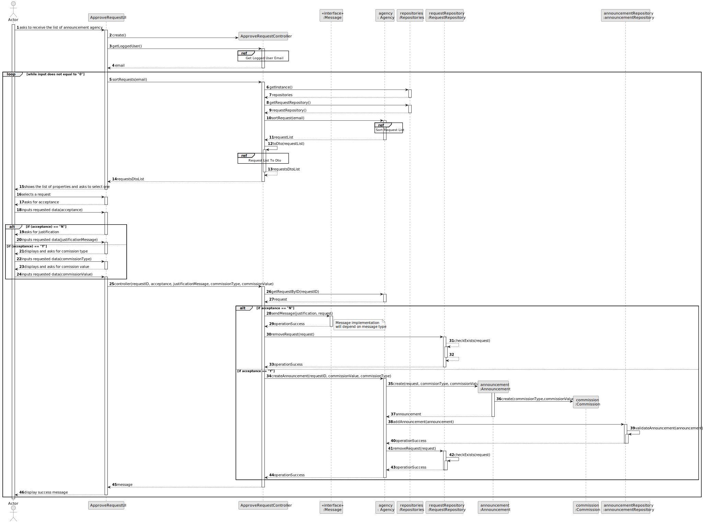
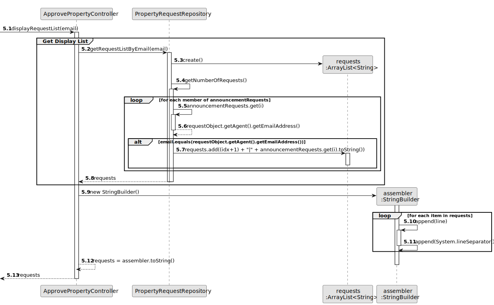
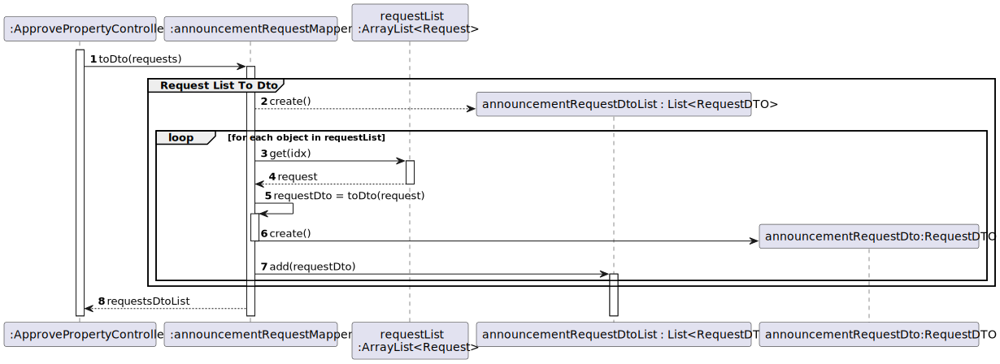
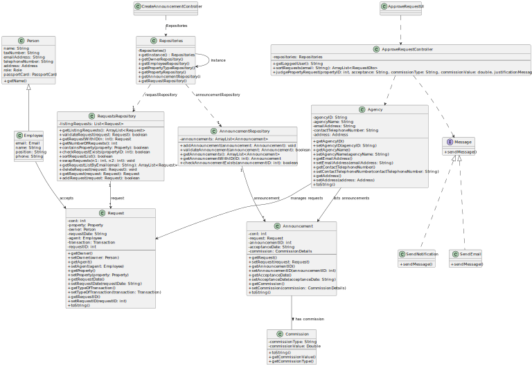

# US 008 - To Approve An Announcement Request

## 3. Design - User Story Realization 

### 3.1. Rationale

**SSD**

| Interaction ID                                               | Question: Which class is responsible for...                                 | Answer                    | Justification (with patterns)                         |
|:-------------------------------------------------------------|:----------------------------------------------------------------------------|:--------------------------|:------------------------------------------------------|
| Step 1 - asks to receive the list of announcement requests   | ... instantiating the Controller   ?                                        | AprovePropertyUI          | Pure Fabrication                                      |
|                                                              | ... coordinating the US                                                     | ApprovePropertyController | Controller                                            |
|                                                              | ... knowing which user is using the system ?                                | UserSession               | Pure Fabrication                                      |
|                                                              | ... temporarily keeping the User Session ?                                  | ApprovePropertyController | Pure Fabrication                                      |
|                                                              | ... getting the User ID ?                                                   | UserSession               | Pure Fabrication                                      |
|                                                              | ... temporarily keeping the User ID ?                                       | ApprovePropertyController | Pure Fabrication                                      |
|                                                              | ... getting the UserSession ?                                               | UserSession               | Pure Fabrication                                      |
|                                                              | ... sorting the property request list in the property request repository ?  | Agency                    | Pure Fabrication                                      |
|                                                              | ... converting the requests list to a dto                                   | RequestMapper             | Pure Fabrication                                      |
|                                                              | ... temporarily keeping the UserSession ?                                   | ApprovePropertyController | Pure Fabrication                                      |
| Step 2 - shows the list of properties and asks to select one | ... displaying the announcement requests               ?                    | ApprovePropertyUI         | Pure Fabrication                                      |
| Step 3 - selects a property                                  | ... displaying the request details      ?                                   | ApprovePropertyUI         | Pure Fabrication                                      |
|                                                              | ... temporarily storing the requestID  ?                                    | ApprovePropertyController | Pure Fabrication                                      |
| Step 4 - asks for acceptance                                 | ... displaying the acceptance options   ?                                   | ApprovePropertyUI         | Pure Fabrication                                      |
| Step 5 - inputs acceptance                                   | ... temporarily storing the acceptance   ?                                  | ApprovePropertyUI         | Pure Fabrication                                      |
| Step 6 - asks for justification                              | ... displaying the justification request                                    | ApprovePropertyUI         | Pure Fabrication                                      |
| Step 7 - inputs requested data                               | ... temporarily storing the justification       ?                           | ApprovePropertyUI         | Pure Fabrication                                      |
|                                                              | ... temporarily storing the acceptance           ?                          | ApprovePropertyUI         | Pure Fabrication                                      |
| Step 8 - displays and asks for comission type                | ... displaying the commission type                               ?          | ApprovePropertyUI         | Pure Fabrication                                      |
| Step 9 - inputs requested data                               | ... temporarily storing the comission types                    ?            | ApprovePropertyUI         | Pure Fabrication                                      |
| Step 10 - displays and asks for comission value              | ... displaying the commission values                            ?           | ApprovePropertyUI         | Pure Fabrication                                      |
| Step 11 - inputs requested data                              | ... temporarily storing the commission amount                   ?           | ApprovePropertyUI         | Pure Fabrication                                      |
|                                                              | ... sending the notification                                                | SendNotification          | PureFabrication                                       |
|                                                              | ... creating the Announcement object ?                                      | Agency                    | Creator (Rule 2 : in the DM agency has announcements) |
|                                                              | ... creating the Commission object ?                                        | Announcement              | Pure Fabrication                                      |
|                                                              | ... storing the object in the repository                ?                   | AnnouncementRepository    | Pure Fabriaction                                      |
|                                                              | ... removing the object from the requestList ?                              | RequestRepository         | Pure Fabrication                                      |
| Step 12 - displays status messages                           | ... displaying the status message                                         ? | ApprovePropertyUI         | Pure Fabrication                                      |

### Systematization ##

According to the taken rationale, the conceptual classes promoted to software classes are: 

 * AuthenticationRepository
 * Commission
 * Announcement
 * Request
 * Agency

Other software classes (i.e. Pure Fabrication) identified: 

 * User
 * ApproveProperty Controller
 * ApprovePropertyUI
 * Email
 * UserSession
 * SendNotification

## 3.2. Sequence Diagram (SD)

### Partial Diagrams

These diagrams show the interactions referenced in the SD Full Diagram 

### Accept Announcement Partial Diagram

### Get Logged User Email Partial Diagram

### Get Request List Partial Diagram

### Request List To DTO Partial Diagram

## 3.3. Class Diagram (CD)

