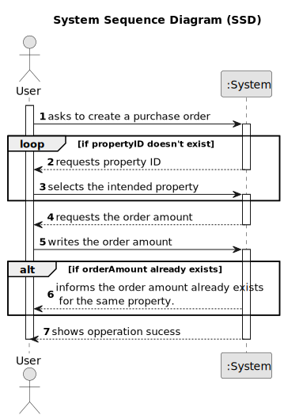

# US 010 - Order to Purchase a Property

## 1. Requirements Engineering

### 1.1. User Story Description

As a client, I place an order to purchase the property, submitting the order
amount.

### 1.2. Customer Specifications and Clarifications

**From the specifications document:**

>	When the client decides to buy/rent the property, he sends a request for the purchase/lease of the
property to the agent. After being appreciated by the agent, he accepts or rejects the order. If the
request is accepted, the offer will not be shown again to clients using the application.

**From the client clarifications:**

> **Question:** What data is required, in addition to the order value, so that a client can place an order to purchase a property?
>
> **Answer:** Only the order amount.

> **Question:** Regarding the us010 i had a question about the order of the client. After the client sent an order to purchase the property where does the request go to? To the agency, to the owner, to the store?
>
> **Answer:** I don not understand your question and I think you are confusing things. Please discuss this question with your teammates and class teachers. Remember that I am your client and not your ESOFT teacher. 

> **Question:** When the client intends to place a purchase order, should the list of properties (announcements) be presented initially and then asked to select a property?
>
> **Answer:** The system should show a list of properties to the client.

> **Question:** Should this User Story be implemented as an addition to US001 (Users can display properties, and select one to make an order), or should it be completely separate, with a separate section of the app dedicated to it?
>
> **Answer:** To place an order the actor should be registered in the system.

> **Question:** To order a purchase of a property, should the client be able to filter the properties by type of property, city, district....so that it's easier to find the wanted property, or should the system show the entire list of properties to sale?
>
> **Answer:** The system should show a list of properties to the client. Filtering is a useful feature of the system, please prepare a user friendly and effective filtering to show the properties to the client.

> **Question:** When showing the other order on the screen, what data should be shown (eg client name, published date, order status)?
>
> **Answer:** If the order amount submitted by the client has already been posted for the property (by another request from this client or any other client), the system must state that on the screen. The system should show the message "The order amount submitted has already been posted for this property. Please contact the agent that is responsible for this property.".

> **Question:** In US10, can the client remove an offer they made at any point, in order to replace it with a different one?
>
> **Answer:** No.

> **Question:** If a client makes an order of equal or lower value to a previous one, the older order will be considered first. The system should state this on the screen, but should this information be shown to the client, the agent, or both?
>
> **Answer:** Please check who is the ator of this Us and check again the acceptance criteria of this US.

### 1.3. Acceptance Criteria

* **AC1:** The order amount submitted by the client must be equal to or lower than
  the price set by the owner for the property.
* **AC2:** If the order amount submitted by the client has already been posted for
  the property (by another request from this client or any other client), the
  system must state that on the screen and the order placed previously should be
  considered first when selling the property.
* **AC3:** A client can only submit a new order to purchase the same property after
  the previous one is declined.
* **AC4:** A client can't remove an offer that they already made.
* **AC5:** "The system should show a list of properties to the client."

### 1.4. Found out Dependencies

* There is a dependency to US003 "As an agent, I intend to see the list of property announcement requests made
  to myself, so that I can post the announcement" as the property needs to be approved to be placed a purchase order.

### 1.5 Input and Output Data

**Input Data:**

* Typed data:
  * The order amount.
  

* Selected data:
  * The selected property.

**Output Data:**

* Operation Result (Successful/Unsuccessful)

### 1.6. System Sequence Diagram (SSD)

### 1.7 Other Relevant Remarks

None at the moment.