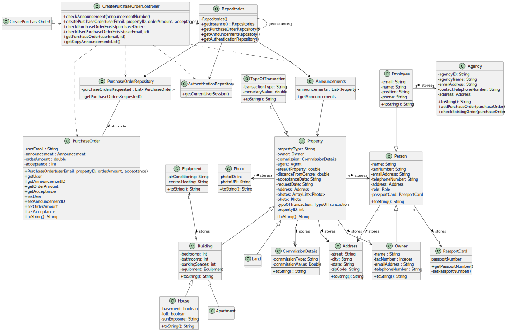

# US 010 - Order to Purchase a Property 

## 3. Design - User Story Realization 

### 3.1. Rationale

**SSD - Alternative 1 is adopted.**

| Interaction ID                          | Question: Which class is responsible for...       | Answer                          | Justification (with patterns)                         |
|:----------------------------------------|:--------------------------------------------------|:--------------------------------|:------------------------------------------------------|
| Step 1: asks to create a purchase order | ... instantianting the class that handles the UI? | *CreatePurchaseOrderUI*         | Pure Fabrication                                      |
|                                         | ... coordinating the US?                          | *CreatePurchaseOrderController* | Controller                                            |
| Step 2: requests data                   | ... displaying the requested information?         | *CreatePurchaseOrderUI*         | Pure Fabrication                                      |
|                                         | ... having the list of announcements?             | Announcements                   | Creator                                               |
| Step 3: selects the intended property   | ... read the selected information?                | *CreatePurchaseOrderUI*         | Pure Fabrication                                      |
|                                         | ... checking if the property exists?              | *CreatePurchaseOrderController* | Controller                                            |
|                                         | ... having the properties available for purchase? | Announcements                   | Creator                                               |
|                                         | ... saving the selected information?              | *CreatePurchaseOrderController* | Controller                                            |
| Step 4: requests the order amount       | ... displaying the requested information?         | *CreatePurchaseOrderUI*         | Pure Fabrication                                      |
| Step 5: writes the order amount         | ... read the written information?                 | *CreatePurchaseOrderUI*         | Pure Fabrication                                      |
|                                         | ... saving the written information?               | *CreatePurchaseOrderController* | Controller                                            |
| Step 6: sends request to the agent      | ... creating a purchase order?                    | PurchaseOrder                   | Pure Fabrication                                      |
|                                         | ... storing the purchase order?                   | PurchaseOrderRepository         | IE: all the purchase orders for the agent to validate |
| Step 7: shows opperation sucess         | ... knowing the opperation sucess?                | *CreatePurchaseOrderController* | Controller                                            | 
|                                         | ... displaying the opperation sucess?             | *CreatePurchaseOrderUI*         | Pure Fabrication                                      |

### Systematization ##

According to the taken rationale, the conceptual classes promoted to software classes are: 

 * PurchaseOrder

Other software classes (i.e. Pure Fabrication) identified: 

 * User
 * CreatePurchaseOrderUI
 * CreatePurchaseOrderController
 * Announcements

## 3.2. Sequence Diagram (SD)

### Alternative 1 - Full Diagram

This diagram shows the full sequence of interactions between the classes involved in the realization of this user story.

## 3.3. Class Diagram (CD)

