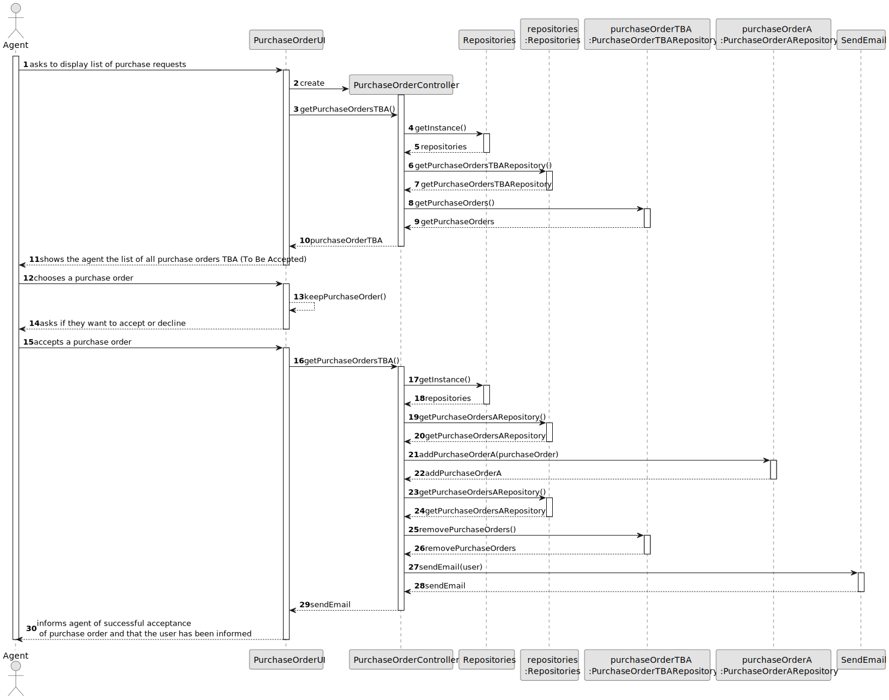
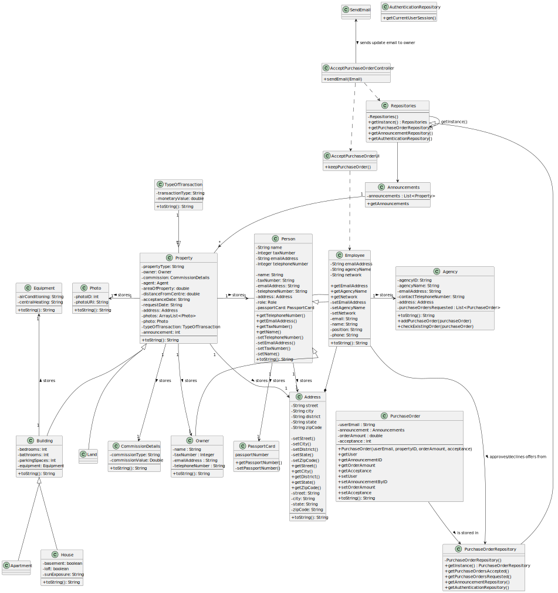

# US 011 - To accept or decline a purchase order for a property 

## 3. Design - User Story Realization 

### 3.1. Rationale
informs agent of successful acceptance of purchase order and that the user has been informed
**SSD - Alternative 1 is adopted.**

| Interaction ID                                                                                                  | Question: Which class is responsible for...                             | Answer                       | Justification (with patterns) |
|:----------------------------------------------------------------------------------------------------------------|:------------------------------------------------------------------------|:-----------------------------|:------------------------------|
| Step \ Msg 1 : asks to receive the list of purchase orders                                                      | ... displaying the purchase order list?                                 | *PurchaseOrderUI*            | Pure Fabrication              |
| Step \ Msg 2 : shows the list of purchase orders and asks to select one 		                                      | 	... keep the choosen purchase order temporarily?                       | *PurchaseOrderUI*            | Pure Fabrication              |
| 		                                                                                                              | 	... have the property that is connected to the purchase order?         | *AnnouncementRepository*     | Information Expert            |
| Step \ Msg 3 : declines offer                                                                                   | ... displaying the button to decline or accept?                         | *PurchaseOrderUI*            | Pure Fabrication              |
| Step \ Msg 4 : deletes offer from system                                                                        | ... responsible for having the purchase orders to be accepted?          | *PurchaseOrderTBARepository* | Information Expert            |
|                                                                                                                 | ... responsible for having the purchase orders that have been accepted? | *PurchaseOrderARepository*   | Information Expert            |
|                                                                                                                 | ... removing the purchase order from the system?                        | *PurchaseOrderTBARepository* | Information Expert            |
|                                                                                                                 | ... responsible for instancing the UI?                                  | *PurchaseOrderController*    | Pure Fabrication              |
| Step \ Msg 5 : sends email to inform the user responsible for the offer  		                                     | 	... sending the email to the user?                                     | *Email*                      | Pure Fabrication              | 
| Step \ Msg 6 : informs agent of successful deletion of purchase order and that the user has been informed 		    | 	... showing the success message to the user                            | *PurchaseOrderUI*            | Pure Fabrication              | 
| Step \ Msg 7 : asks agent if they want to continue or if they want to exit 		                                   | 	... showing the button for the options?                                | *PurchaseOrderUI*            | Pure Fabrication              | 
| Step \ Msg 8 : wants to continue 		                                                                             | 	... for assuring the agent has the option to be in the loop or not?    | *PurchaseOrderUI*            | Pure Fabrication              | 
| Step \ Msg 9 : shows the list of purchase orders and asks to select one 		                                      | 	... keep the choosen purchase order temporarily?                       | *PurchaseOrderUI*            | Pure Fabrication              |
| 		                                                                                                              | 	... have the property that is connected to the purchase order?         | *AnnouncementRepository*     | Information Expert            |
| Step \ Msg 10 : accepts offer                                                                                   | ... displaying the button to decline or accept?                         | *PurchaseOrderUI*            | Pure Fabrication              |
| Step \ Msg 11 : deletes offer from TBA repository and adds to the list of accepted ones                         | ... responsible for having the purchase orders to be accepted?          | *PurchaseOrderTBARepository* | Information Expert            |
|                                                                                                                 | ... responsible for having the purchase orders that have been accepted? | *PurchaseOrderARepository*   | Information Expert            |
|                                                                                                                 | ... removing the purchase order from the system?                        | *PurchaseOrderTBARepository* | Information Expert            |
|                                                                                                                 | ... responsible for adding the offer to the accepted list?              | *PurchaseOrderController*    | Pure Fabrication              |
| Step \ Msg 12 : sends email to inform the user responsible for the offer  		                                    | 	... sending the email to the user?                                     | *Email*                      | Pure Fabrication              | 
| Step \ Msg 13 : informs agent of successful acceptance of purchase order and that the user has been informed 		 | 	... showing the success message to the user                            | *PurchaseOrderUI*            | Pure Fabrication              | 
| Step \ Msg 14 : asks agent if they want to continue or if they want to exit 		                                  | 	... showing the button for the options?                                | *PurchaseOrderUI*            | Pure Fabrication              | 
| Step \ Msg 15 : wants to continue 		                                                                            | 	... for assuring the agent has the option to be in the loop or not?    | *PurchaseOrderUI*            | Pure Fabrication              | 
| Step \ Msg 16 : shows the list of purchase orders and asks to select one 		                                     | 	... keep the choosen purchase order temporarily?                       | *PurchaseOrderUI*            | Pure Fabrication              |
| 		                                                                                                              | 	... have the property that is connected to the purchase order?         | *AnnouncementRepository*     | Information Expert            |
| Step \ Msg 17 : displays operation success 		                                                                   | 	... knowing the operation success?                                     | *PurchaseOrderController*    | Pure Fabrication              | 

### Systematization ##

According to the taken rationale, the conceptual classes promoted to software classes are: 

 * Agent
 * PurchaseRepository
 * PurchaseOrderTBARepository
 * PurchaseOrderARepository
 * AnnouncementRepository

Other software classes (i.e. Pure Fabrication) identified: 

 * PurchaseOrderUI
 * PurchaseOrderController

## 3.2. Sequence Diagram (SD)

### Alternative 1 - Full Diagram

This diagram shows the full sequence of interactions between the classes involved in the realization of this user story.

## 3.3. Class Diagram (CD)

