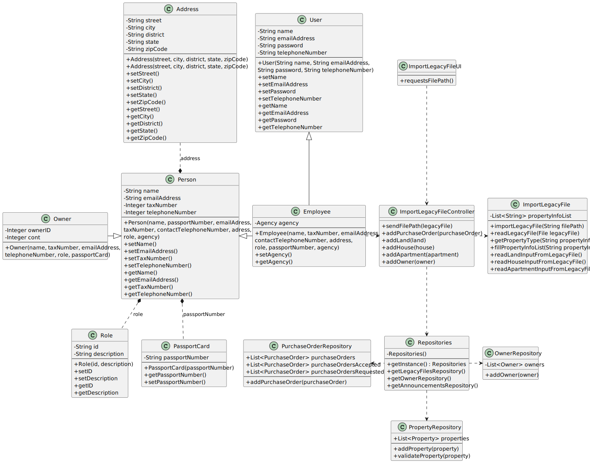

# US 012 - To import information from a legacy system

## 3. Design - User Story Realization

### 3.1. Rationale

**SSD - Alternative 1 is adopted.**

| Interaction ID                                             | Question: Which class is responsible for...             | Answer                                                             | Justification (with patterns)                                                                                 |
|:-----------------------------------------------------------|:--------------------------------------------------------|:-------------------------------------------------------------------|:--------------------------------------------------------------------------------------------------------------|
| Step 1: asks to import information from a legacy system 		 | 	...instantiating the class that handles the UI?        | ImportLegacyFileUI                                                 | Pure Fabrication: there is no reason to assign this responsibility to any existing class in the Domain Model. |
| 			  		                                                    | 	... coordinating the US?                               | ImportLegacyFileController                                         | Controller                                                                                                    |
| Step 2: requests file path		                               | ...displaying the UI for the actor to input data?						 | ImportLegacyFileUI                                                 | Pure Fabrication                                                                                              |
| Step 3: types file path and submits data                   | ...temporarily keeping input data?                      | ImportLegacyFileUI                                                 | Pure Fabrication                                                                                              |
|                                                            | ...knowing the repositories used in the US?             | ImportLegacyFileController                                         | Controller                                                                                                    |
|                                                            | ...reading the information from the legacy file?        | ImportLegacyFile                                                   | IE: is responsible for reading legacy files                                                                   |
|                                                            | ...instantiating                                        |                                                                    |                                                                                                               |
|                                                            | ...instantiating                                        |                                                                    |                                                                                                               |
| 	                                                          | ...adding to a repository?                              | LegacyFileController                                               | IE: owns all its files                                                                                        |
|                                                            | ...validating duplicated information?                   | PropertyRepository OwnerRepository PurchaseOrderRepository |                                                                                                               |
| Step 4: displays operation success 		                      | 	...informing operation success?                        | ImportLegacyFileUI                                                 | Pure Fabrication                                                                                              | 

### Systematization ##

According to the taken rationale, the conceptual classes promoted to software classes are:

* LegacyFile

Other software classes (i.e. Pure Fabrication) identified:

* ImportLegacyFileUI
* ImportLegacyFileController
* PropertyRepository
* OwnerRepository
* PurchaseOrderRepository

## 3.2. Sequence Diagram (SD)

### Full Diagram

This diagram shows the full sequence of interactions between the classes involved in the realization of this user story.

## 3.3. Class Diagram (CD)

