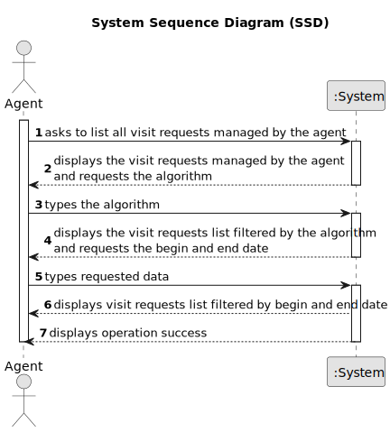

# US 015 - To list all booking requests for properties managed by me

## 1. Requirements Engineering

### 1.1. User Story Description

As an agent, I intend to list all booking requests for properties managed by me.

### 1.2. Customer Specifications and Clarifications

**From the specifications document:**

>   There is no specifications from the document at the moment.

**From the client clarifications:**

> **Question:** Booking is a slightly vague word. Our team wants clarifications on what type of requests the word encompasses (visit requests being our strongest guess, but we are not sure).
>
> **Answer:** It is a visit request.

> **Question:** US015's AC1 states that "The list of requests must be shown for a specific period (begin date, end date)". As such, our team would like to know if you want this time period to be selected or typed, and in which format it should be in.
>
> **Answer:** The dates should be selected. The format should be DD-MM-YYYY.

> **Question:** In US015's AC1, it is stated that "The list of requests must be shown for a specific period (begin date, end date)."
This time period caused confusion, as the team is unsure whether the "date" is referring to the date chosen by the client in the message (See US009's requirements) or the date of creation of the visit request.
>
> **Answer:** The goal is to use the date chosen by the client (the preferred date that you can see in US9) to list booking requests.

> **Question:** Do the Sprint D user stories need to work only on JavaFX or on console as well?
>
> **Answer:** For Sprint D USs you only have to implement a GUI.

> **Question:** One of our questions' answers made us believe there might have been some miscommunication, as it had some significant mistakes in phrasing and your answer wasn't clear enough. As such, here is that same question, in a simpler and clearer way:
US017's AC2 states that "Two sorting algorithms should be implemented (to be chosen manually by the network manager)."
US015's AC2 states that "The list of requests must be sorted by date in ascending order. The sorting algorithm to be used by the application must be defined through a configuration file. At least two sorting algorithms should be available."
As such, the team would like to know if, just like in US017, the sorting methods would be chosen manually in US015.
>
> **Answer:** In US 15 the sorting algorithm to be used by the application must be defined through a configuration file. This is a diferent strategy from what I want in US17. Please study ESOFT.
 
> **Question:** The US15 does the listing and in US16 we are already responsing to one booking request. That said, were is the selection part being done?
>
> **Answer:** In US15 the Agent gets a list of booking requests (made to him). Then, the agent, may want to respond to the user (as defined in US16). US15 and US16 are executed sequentially. Even so, the agent should be able to see a list of all booking requests made to him (US15) without answer any booking request. In US16 the agent selects the booking request.
 

### 1.3. Acceptance Criteria

* **AC1:** The list of requests must be shown for a specific period (begin date, end date).
* **AC2:** The list of requests must be sorted by date in ascending order. The sorting algorithm to be used by the application must be defined through a configuration file. At least two sorting algorithms should be available.
* **AC3:** ?? The users should use a graphical user interface to access the features introduced in Sprint D.
* **AC4:** ?? The application should use object serialization to ensure persistence of the data between two runs of the application. Serialization must be applied to all classes developed in all sprints.

### 1.4. Found out Dependencies

* There is a dependency on US03 (To register a new employee), because this US is responsible for registering the agent from US015.
* There is a dependency on US07 (To Register in the System), because this US is responsible for creating the user that can become a client.
* There is a dependency on US09 (Messaging for a visit), because this US is responsible for make a visit request.

### 1.5 Input and Output Data

**Input Data:**

* Typed Data:
    * algorithm
    * begin date
    * end date

* Selected Data:
    * visit request

**Output Data:**

* list of visit requests
* list of visit requests filtered by the begin and end date
* list of visit requests filtered by the algorithm
* (un)successful operation

### 1.6. System Sequence Diagram (SSD)

### 1.7 Other Relevant Remarks

There is no other relevant remarks.