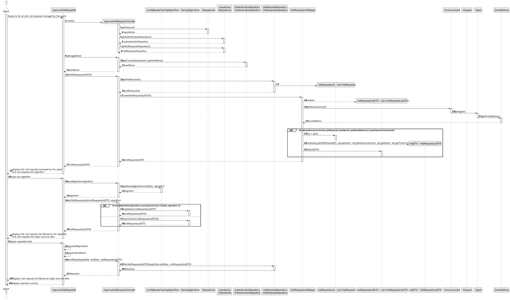
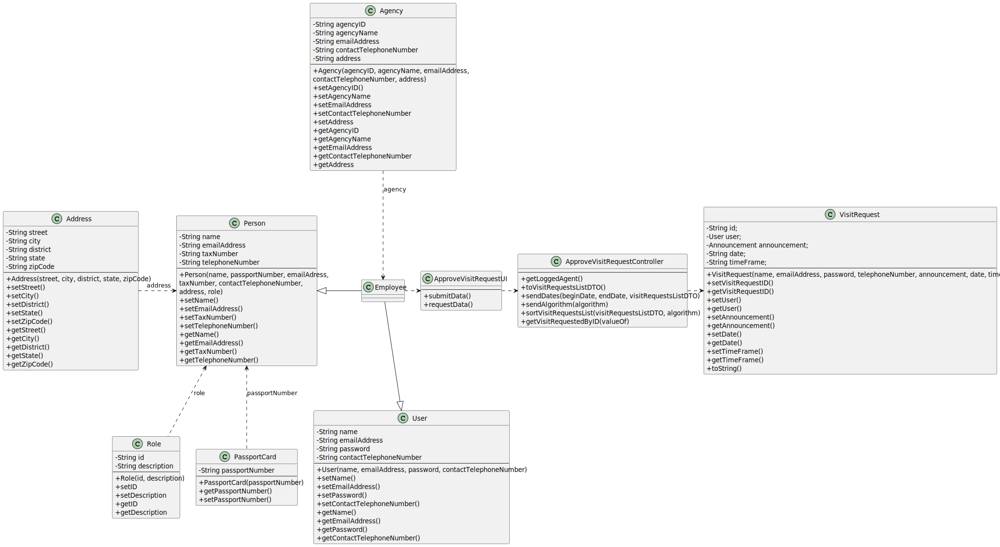

# US 015 - To list all booking requests for properties managed by me

## 3. Design - User Story Realization

### 3.1. Rationale

**SSD - Alternative 1 is adopted.**

| Interaction ID                                                          | Question: Which class is responsible for...                  | Answer                     | Justification (with patterns)                                                                                 |
|:------------------------------------------------------------------------|:-------------------------------------------------------------|:---------------------------|:--------------------------------------------------------------------------------------------------------------|
| Step 1: asks to list all visit requests for properties managed by me 		 | 	...instantiating the class that handles the UI?             | ListVisitRequestUI         | Pure Fabrication: there is no reason to assign this responsibility to any existing class in the Domain Model. |
| 			  		                                                                 | 	... coordinating the US?                                    | ListVisitRequestController | Controller                                                                                                    |
|                                                                         | ...knowing the visit request list for that agent?            | VisitRequest               | Creator (): !!!!!                                                                                             |
|                                                                         | ...listing visit requests sorted by date in ascending order? | ???                        | Creator (): !!!!!                                                                                             |
|                                                                         | ...displaying the visit requests list?                       | ListVisitRequestUI         | IE: is responsible for user interactions.                                                                     |
| Step 2: displays visit request list 		                                  | ...displaying the UI for the actor to input data?						      | ListVisitRequestUI         | IE: is responsible for user interactions.                                                                     |

### Systematization ##

According to the taken rationale, the conceptual classes promoted to software classes are:

* VisitRequest

Other software classes (i.e. Pure Fabrication) identified:

* ListVisitRequestUI
* ListVisitRequestController

## 3.2. Sequence Diagram (SD)

### Alternative 1 - Full Diagram

This diagram shows the full sequence of interactions between the classes involved in the realization of this user story.

## 3.3. Class Diagram (CD)

