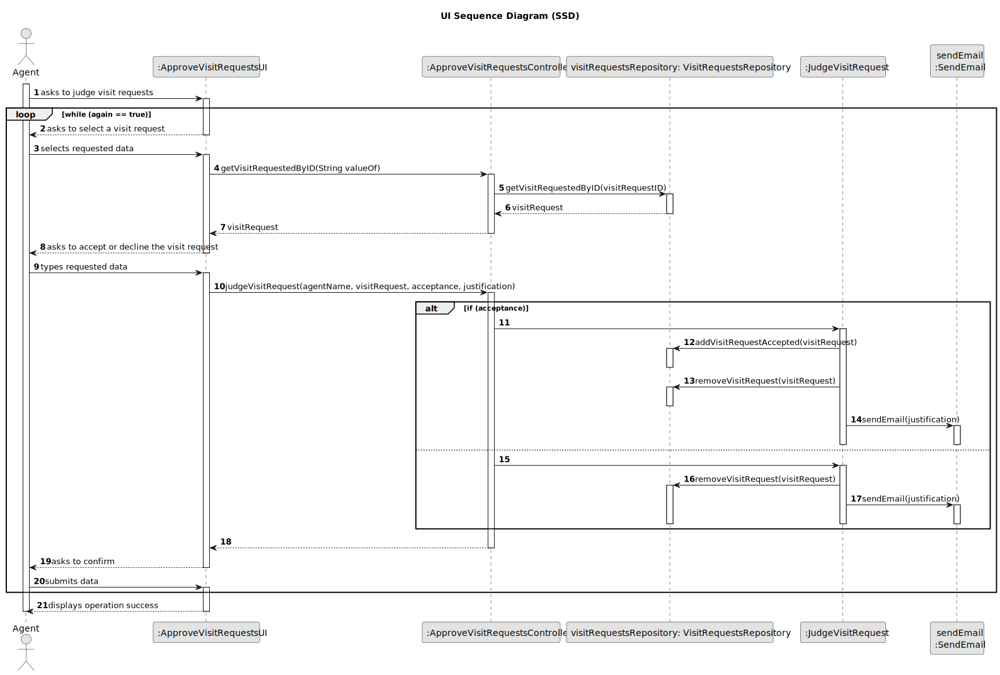
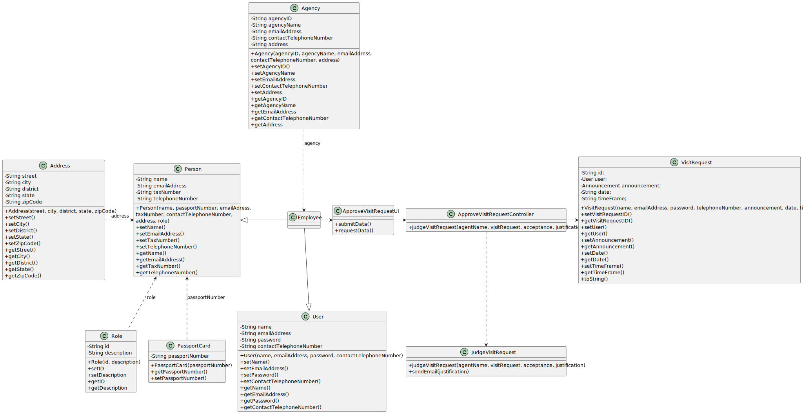

# US 016 - To respond to the user that scheduled the visit

## 3. Design - User Story Realization

### 3.1. Rationale

**SSD - Alternative 1 is adopted.**

| Interaction ID                                                           | Question: Which class is responsible for...                 |                            | Answer                                                                                                        | Justification (with patterns) |
|:-------------------------------------------------------------------------|:------------------------------------------------------------|----------------------------|:--------------------------------------------------------------------------------------------------------------|:------------------------------|
| Step 1: asks to list all visit requests for properties managed by me 		  | 	...instantiating the class that handles the UI?            | ListVisitRequestUI         | Pure Fabrication: there is no reason to assign this responsibility to any existing class in the Domain Model. |
| 			  		                                                                  | 	... coordinating the US?                                   | ListVisitRequestController | Controller                                                                                                    |
|                                                                          | ...knowing the visit request list for that agent?           | VisitRequest               | IE: knows its own data.                                                                                       |
|                                                                          | ...listing visit request sorted by date in ascending order? | ???                        | ???                                                                                                           |
|                                                                          | ...instantiating the visit request list?                    | VisitRequest               | Creator (Rule ?): contains the visit requests repository.                                                     |
|                                                                          | ...displaying the visit request list?                       | ListVisitRequestUI         | IE: is responsible for user interactions.                                                                     |
| Step 2: displays visit request list and asks to select a visit request		 | ...having the visit request list?						                     | VisitRequest               | IE: has its own data.                                                                                         |
| 		                                                                       | ...displaying the visit request list?						                 | ListVisitRequestUI         | IE: is responsible for user interactions.                                                                     |
| Step 3: selects a visit request                                          | ...displaying the UI for the agent to select data?	         | ListVisitRequestUI         | IE: is responsible for user interactions.                                                                     |
| 		                                                                       | ...validating the selected data?						                      | Utils                      | IE: has methods of validation.                                                                                |
| Step 4: asks to accept or decline the visit request                      | ...displaying the message?                                  | ListVisitRequestUI         | IE: is responsible for user interactions.                                                                     |
| Step 5: types requested data  		                                         | 	...displaying the UI for the agent to input data?	         | ListVisitRequestUI         | IE: is responsible for user interactions.                                                                     |
| 		                                                                       | ...validating the selected data?						                      | Utils                      | Pure Fabrication / IE: has methods of validation.                                                             |
| Step 6: asks to confirm 		                                               | 	...displaying the message?                                 | ListVisitRequestUI         | IE: is responsible for user interactions.                                                                     |
| Step 7: submits data 		                                                  | 	......displaying the UI for the agent to input data?       | ListVisitRequestUI         | IE: is responsible for user interactions.                                                                     |
| 		                                                                       | ...validating the selected data?						                      | Utils                      | IE: has methods of validation.                                                                                |
|                                                                          | ...sending the email to the client?                         | SendEmail                  | IE: is responsible for sending txt. files to email                                                            |
|                                                                          | ...remove accepted visit request from the list              | VisitRequest               | Creator (Rule ?): contains the visit requests repository.                                                     |
| Step 8: displays operation success 		                                    | 	...informing operation success?                            | ListVisitRequestUI         | IE: is responsible for user interactions.                                                                     |

### Systematization ##

According to the taken rationale, the conceptual classes promoted to software classes are:

* VisitRequest
* Utils
* SendEmail

Other software classes (i.e. Pure Fabrication) identified:

* ListVisitRequestUI
* ListVisitRequestController

## 3.2. Sequence Diagram (SD)

### Alternative 1 - Full Diagram

This diagram shows the full sequence of interactions between the classes involved in the realization of this user story.

## 3.3. Class Diagram (CD)

