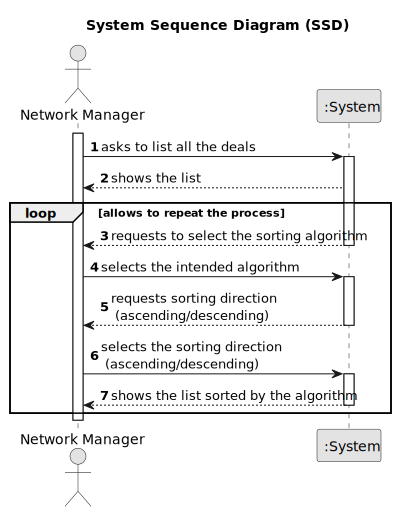

# US 017 - To List All Deals

## 1. Requirements Engineering

### 1.1. User Story Description

As a network manager, I want to list all deals made.

### 1.2. Customer Specifications and Clarifications

**From the specifications document:**

>	Each store in the network has a store manager and the set of stores is managed by a store network
manager. The main functions of a store manager are to monitor and streamline the branch with the
aim of getting to know better the business carried out and to analyse and evaluate the performance
of employees.

>   The manager of the network intends to analyse the performance of each of the branches and the
global behaviour of the network on a daily basis.

**From the client clarifications:**

> **Question:** What should be the default order of the deals when displaying them to the network manager?
> 
> **Answer:** The default is to sort deals from the most recent ones to the oldest ones.

> **Question:** In this User Story it is requested that "All deals made" are listed. Are these deals just accepted purchase requests, or are declined purchase requests also included?
> 
> **Answer:** A deal takes place when the proposed purchase/renting is accepted.

> **Question:** Can you confirm that we are analyzing the deals made in all the branches all together?
> 
> **Answer:** Yes, we are analyzing the deals made in all the branches all together.

> **Question:** One of our questions' answers made us believe there might have been some miscommunication, as it had some significant mistakes in phrasing and your answer wasn't clear enough. As such, here is that same question, in a simpler and clearer way:
US017's AC2 states that "Two sorting algorithms should be implemented (to be chosen manually by the network manager)."
US015's AC2 states that "The list of requests must be sorted by date in ascending order. The sorting algorithm to be used by the application must be defined through a configuration file. At least two sorting algorithms should be available."
As such, the team would like to know if, just like in US017, the sorting methods would be chosen manually in US015.
> 
> **Answer:** In US 15 the sorting algorithm to be used by the application must be defined through a configuration file. This is a diferent strategy from what I want in US17. Please study ESOFT.

> **Question:** Regarding the Algorithms, is it supposed to be one for each sorting order, or must both algorithms present both sorting orders?
> 
> **Answer:** The two algorithms can be used for both sorting orders.

> **Question:** We have to present information about the deal, but is it necessary to display any information about the agent/agency that oversees the deal?
>
> **Answer:** Yes, show the store ID and the store name.

### 1.3. Acceptance Criteria

* **AC1:** The actor should be able to sort all properties by property area (square feet) in descending/ascending order.
* **AC2:** Two sorting algorithms should be implemented (to be chosen manually by the network manager).
* **AC3:** Worst-case time complexity of each algorithm should be documented in the application user manual that must be delivered with the application (in the annexes, where algorithms should be written in pseudocode).
* **AC4:** "The default is to sort deals from the most recent ones to the oldest ones."
* **AC5:** "Show the store ID and the store name."

### 1.4. Found out Dependencies

* There's a dependency with the US011 "As an agent, I want to list real estate purchase orders to accept or decline a
  purchase order for a property. After accepting or declining, an email notification
  should be sent to the customer."

### 1.5 Input and Output Data

**Input Data:**

* Typed data:
  * The intended algorithm

**Output Data:**

* All the deals made sorted by the algorithm

### 1.6. System Sequence Diagram (SSD)

### 1.7 Other Relevant Remarks

The users should use a graphical user interface to access the features introduced in Sprint D.

The application should use object serialization to ensure persistence of the data between two runs of the application. Serialization must be applied to all classes developed in all sprints.