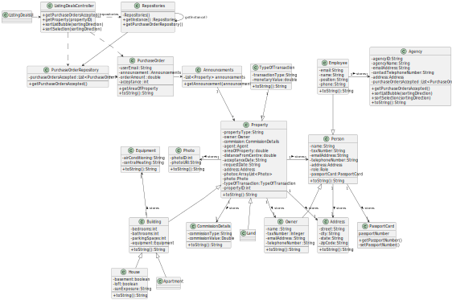

# US 017 - To List All Deals

## 3. Design - User Story Realization 

### 3.1. Rationale

**SSD - Alternative 1 is adopted.**

| Interaction ID                                                 | Question: Which class is responsible for... | Answer                   | Justification (with patterns)                 |
|:---------------------------------------------------------------|:--------------------------------------------|:-------------------------|:----------------------------------------------|
| Step 1: asks to list all the deals                             | ... interacting with the user in this US?   | *ListingDealsUI*         | Pure Fabrication                              |
|                                                                | ... coordinating this US?                   | *ListingDealsController* | Controller                                    |
| Step 2: shows the list                                         | ... displaying all the deals made?          | *ListingDealsUI*         | Pure Fabrication                              |
|                                                                | ... getting the deals made?                 | *ListingDealsController* | Controller                                    |
|                                                                | ... having the purchase orders made?        | PurchaseOrderRepository  | IE: all the purchase orders already validated |
|                                                                | ... having the announcements?               | Announcements            | Creator                                       |
| Step 3: requests to select the sorting algorithm               | ... requesting the sorting algorithm?       | *ListingDealsUI*         | Pure Fabrication                              |
| Step 4: selects the intended algorithm                         | ... reading and validating the response?    | *ListingDealsUI*         | Pure Fabrication                              |
| Step 5: requests sorting direction (ascending/descending)      | ... requesting the sorting direction?       | *ListingDealsUI*         | Pure Fabrication                              | 
| Step 6: selects the sorting direction\n (ascending/descending) | ... reading and validating the response?    | *ListingDealsUI*         | Pure Fabrication                              | 
|                                                                | ... asking to sort the algorithm?           | *ListingDealsController* | Controller                                    |
|                                                                | ... sorting the list with the algorithm?    | PurchaseOrderARepository | IE: all the purchase orders already validated |
| Step 7: shows the list sorted by the algorithm                 | ... displaying the sorted list?             | *ListingDealsUI*         | Pure Fabrication                              | 
|                                                                | ... getting the sorted list?                | *ListingDealsController* | Controller                                    |
|                                                                | ... having the sorted purchase orders list? | PurchaseOrderRepository  | IE: all the purchase orders already validated |
|                                                                | ... having the sorted annoucements list?    | Annoucements             | Creator                                       |

### Systematization ##

According to the taken rationale, the conceptual classes promoted to software classes are: 

 * PurchaseOrder
 * Property

Other software classes (i.e. Pure Fabrication) identified: 

 * Announcements
 * ListingDealsUI
 * ListingDealsController

## 3.2. Sequence Diagram (SD)

### Alternative 1 - Full Diagram

This diagram shows the full sequence of interactions between the classes involved in the realization of this user story.

## 3.3. Class Diagram (CD)

