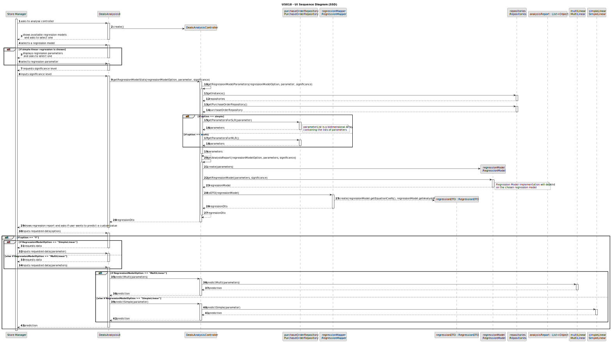
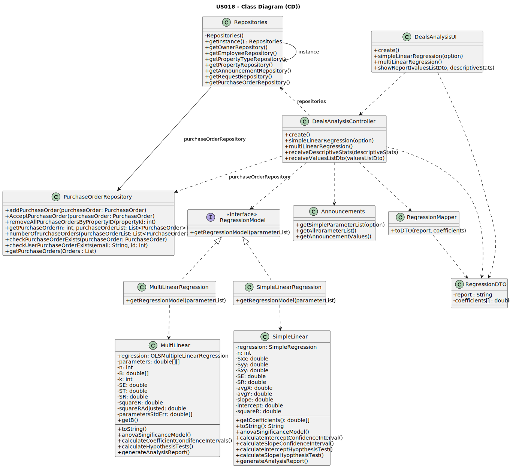

# US 018 - To Register an User 

## 3. Design - User Story Realization 

### 3.1. Rationale

**SSD - Alternative 1 is adopted.**

| Interaction ID                                                                       | Question: Which class is responsible for...        | Answer                  | Justification (with patterns) |
|:-------------------------------------------------------------------------------------|:---------------------------------------------------|:------------------------|:------------------------------|
| Step 1: asks to analyse deals 		                                                     | 	interacting with the actor?                       | DealsAnalysisUI         | Pure Fabrication              | 
|                                                                                      | ... coordinating the US                            | DealsAnalysisController | Controller                    |
|                                                                                      | ... instantiating a new regression model  ?        | Analysis                | Pure Fabrication              |
| Step 2  shows available regression models and asks to selct one                      |                                                    |                         |                               |
| Step 3:            selects a regression model                                        | ... temporarily saving the inputted data?          | DealsAnalysisUI         | Pure Fabrication              |
| Step 4: displays regression parameters and asks to select one                        | ... temporarily storing regression parameters?     | DealsAnalysisUI         | Pure Fabrication              |
| Step 5: selects a regression parameter                                               | ... temporarily storing regression parameters ?    | DealsAnalysisUI         | Pure Fabrication              |
|                                                                                      | ... getting the regression parameters              | DealsAnalysisController | Pure Fabrication              |
|                                                                                      | ... creating the Regression object                 | RegressionModel         | PureFabrication               |
| Step 6: shows regression analysis report and asks if user wants to make a prediction | ... displaying the analysis report               ? | DealsAnalysisUI         | Pure Fabrication              |
|                                                                                      | ... temporarily storing the option ?               | DealsAnalysisUI         | Pure Fabrication              |
| Step 7: requests data                                                                |                                                    |                         |                               |
| Step 8: inputs requested data                                                        | ... temporarily storing the parameter?             | DealsAnalysisUI         | Pure Fabrication              |
|                                                                                      | ... generating the prediction ?                    | SimpleLinear            | Pure Fabrication              |
| Step 9: displays prediction                                                          |                                                    |                         |                               |
| Step 10: requests data                                                               |                                                    |                         |                               |
| Step 11: inputs requested data                                                       | ... temporarily storing the 5 parameters?          | DealsAnalysisUI         | Pure Fabrication              |
|                                                                                      | ... generating the prediction ?                    | MultiLinear             | Pure Fabrication              |
| Step 12: displays prediction                                                         |                                                    |                         |                               |

### Systematization ##

According to the taken rationale, the conceptual classes promoted to software classes are:

Other software classes (i.e. Pure Fabrication) identified: 

* RegressionModel
* MultiLineaar
* SimpleLinear

## 3.2. Sequence Diagram (SD)

### Alternative 1 - Full Diagram

This diagram shows the full sequence of interactions between the classes involved in the realization of this user story.

## 3.3. Class Diagram (CD)

