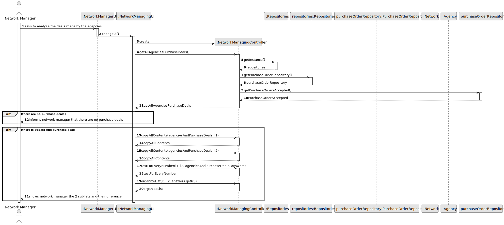
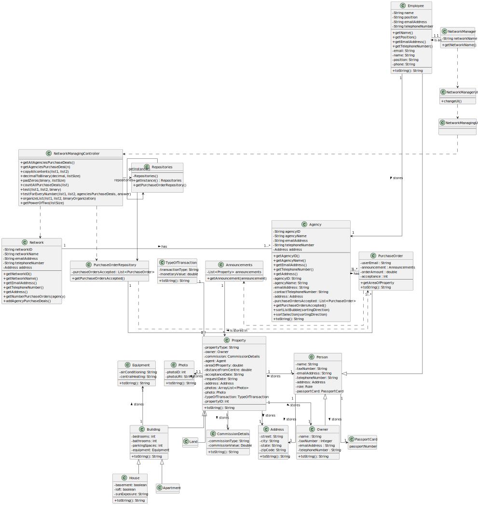

# US 019 - Dividing sets of all stores

## 3. Design - User Story Realization

### 3.1. Rationale

**SSD - Alternative 1 is adopted.**

| Interaction ID                                        | Question: Which class is responsible for...                             | Answer              | Justification (with patterns) |
|:------------------------------------------------------|:------------------------------------------------------------------------|:--------------------|:------------------------------|
| Step 1: asks to divide the set into two               | ...obtaining the currents list of all stores with their purchase deals? | *Network*           | Information Expert            |
|                                                       | ...obtaining the all the purchase deals of a certain agency?            | *PurchaseOrder*     | Information Expert, Creator   |
|                                                       | ...diving the set of stores in 2 sub sets?                              | *Network*           | Information Expert            |
| Step 2: shows the new 2 sub sets and their difference | ... displaying the new list and their differences?                      | *NetworkManagingUI* | Pure Fabrication              |

### Systematization ##

According to the taken rationale, the conceptual classes promoted to software classes are:

* Network

Other software classes (i.e. Pure Fabrication) identified:

* NetworkManagerUI
* NetworkManagingUI
* NetworkManagingController

## 3.2. Sequence Diagram (SD)

### Alternative 1 - Full Diagram

This diagram shows the full sequence of interactions between the classes involved in the realization of this user story.

## 3.3. Class Diagram (CD)

